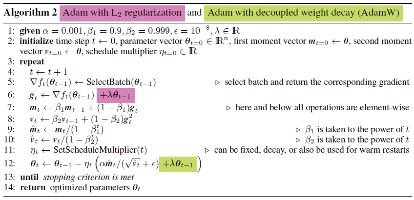

# Decoupled Weight Decay Regularization
---

## 1. Introduction
AdaGrad, RMSProp, Adam, AMSGrad 등의 Adaptive gradient 방법론들은 feed-forward Networks 혹은 RNNs를 학습시키는 디폴트 선택지가 되어 가고 있음. 그러나, 이미지 분류와 같은 경우에는 (CIFAR-10 or CIFAR-100) Momentum을 추가한 SGD 방법론으로부터 SOTA 모델을 얻게되는 경우가 많음.

더 나아가, Wilson et al. (2017)은 다양한 딥러닝 태스크에서 adaptive gradient methods가 momentum을 추가한 SGD의 일반화 성능에 못미친다는 연구 결과를 발표함.

이러한 뒤떨어지는 일반화 성능의 원인에 대한 여러 연구가 발표되었는데, 그 원인으로 sharp local minima의 존재(Keskar et al., 2016; Dinh et al., 2017) 혹은 adaptive gradient methods 알고리즘 내부적인 문제(Wilson et al., 2017) 등이 제기 되었음.

이 연구에서는, SGD와 Adam을 이용하여 deep neural networks를 학습시키고, L2 regularization(이하, L2 reg)을 사용하는 것이 좋을지 weight decay ragularization을 사용하는 것이 좋을지에 대해 알아봄.

adaptive gradient algorithms 중 가장 인기 있는 선택지인 Adam으로 실험을 진행해보았을 때, Adam의 좋지 못한 일반화 성능의 원인은 Adam에서의 L2 reg가 SGD에서 L2 reg가 적용되는 것만큼 효과적이지 못하기 때문임을 파악함.

특히, Adam에 대한 분석은 다음과 같은 observation으로 이어짐:

- L2 regularization과 Weight decay는 동일하지 않다.
  - SGD의 경우에는 weight decay factor를 learning rate에 대해서 reparametrization을 적용해주면, L2 reg와 weight decay가 동일해짐. 하지만, 이는 Adam에서는 유효하지 않음. 특히, Adaptive gradients와 L2 regularization이 함께 적용될 때에는 parameter 크기가 대체적으로 크게 유지되어 온 파라미터 및 gradient와 같은 경우에는 weight decay를 호라용할 때보다 더 적게 regularize되는 현상이 발생.
  - 즉, weight decay를 해주겠다고 L2 reg term을 loss에 추가해준다고 해서 weight decay의 효과를 온전히 볼 수 없다는 것임.
- L2 regularization is not effective in Adam.
  - 대부분의 딥러닝 라이브러리에서는 original weight decay가 아닌, L2 regularization만 구현이 되어 있음. 그러므로, SGD에 L2 reg를 사용하는 것이 더 유리할 때에 (대부분의 이미지 분류 데이터셋 학습의 경우) Adam이 SGD with momentum (L2 regularization이 예상대로 동작하는 경우)보다 더 좋지 못한 결과를 가져오게 됨. 
- Weight decay is equally effective in both SGD and Adam.
  - SGD 같은 경우에는 L2 regularization이 Weight Decay와 동일하게 작용할 수 있지만,
  - Adam 같은 경우에는 L2 regularization은 Weight Decay와 다르다는 점에 유의할 것.
- Optimal weight decay depends on the total number of batch passes/weight updates.
  - SGD와 Adam에 대해 실험을 진행한 결과, 실행 시간이 길어질수록 (batch pass가 많아질수록) 최적의 weight decay 값은 작아짐.
- Adam can substantially benefit from a scheduled learning rate multiplier.
  - Adam은 adaptive gradient 알고리즘, 그에 따라 각 parameter의 learning rate를 조정함.
  - 그렇다고 해서 cosine annealing과 같은 global learning rate multiplier를 사용하는 게 전체적인 성능 향상을 가져올 수 있다는 가능성을 아예 배제할 수는 없음.

### Contribution
- to improve regularization in Adam by decoupling the weight decay from the gradient-based update (Weight Decay를 gradient based update로부터 분리시킴으로써 Adam 최적화 알고리즘의 규제 효과를 개선함.)
  - Adam generalizes substantially better with decoupled weight decay than with L2 reg, achieving 15% relative improvement in test error.
- our decoupled weight decay renders the optimal settings of learning rate and the weight decay factor much more independent, thereby easing hyperparameter optimization. (learning rate과 weight decay factor의 optimal setting을 보다 독립적으로 세팅 가능 → 따라서 HPO도 수월해짐)

해당 연구의 주 motivation은 Adam을 momentum을 적용한 SGD와 견줄 만한 성능을 보이도록 개선하는 것이었음. 이를 통해서 실제 모델 학습 시, Adam과 SGD 간 비교하며 어떤 optimizer를 사용할지 고민하지 않아도 되며 결국엔 task specific하게 학습 알고리즘과 그 하이퍼파라미터를 고르는 수고로움을 덜 수 있음.

## 2. Decoupling the weight decay form the gradient-based update

- original weight decay
  $$ \theta_{t+1} = (1-\lambda)\theta_t - \alpha \nabla f_t(\theta_t)\qquad(1)$$ 

  where $\lambda$ defines the rate of the weight decay per step and $\nabla f_t(\theta_t)$ is the t-th batch gradient to be multiplied by a learning rate $\alpha$. 기본 SGD의 경우 (1)은 L2 reg와 동치이다.

 

- SGDW

 

- AdamW

 

### Proposition 1. Weight decay = $L_2$ reg for standard SGD
Standard SGD with base learning rate $\alpha$ executes the same steps on batch loss functions $f_t(\theta)$ with weight decay $\lambda$ as it executes without weight decay on $f_t^{reg}(\theta) = f_t(\theta) + \lambda' \lVert\theta\lVert_2^2$, with $\lambda'=\frac{\lambda}{\alpha}.$

- proof

그러나, adaptive gradient methods와 같은 경우엔 L2 reg가 Weight decay로 동치되지 않는다. 또한, lambda 값을 learning rate로 나누어주는 보정 (reparameterization)이 따로 필요하다는 점을 간과하지 말 것. 따라서 $\lambda$에 대한 일반적인 최적값이 존재한다고 할 때, 실제로 weight decay 시 적용되는 weight decay factor $\lambda'$는 learning rate $\alpha$와 밀접하게 관련되어 있음.

두 하이퍼 파라미터의 영향을 분리시키기 위해 위의 (1)처럼 weight decay step을 Gradient 계산에서 분리시키고자 함 (SGDW for SGD, AdamW for Adam). 

adaptive gradient methods와 같은 경우, gradients의 이전 크기들로 현재 gradients 스케일링하게 된다. 직관적으로 생각해보면, Adam이 L2 reg를 추가한 손실 함수 위에서 동작한다고 했을 때, 큰 값의 gradients를 가진 weights의 경우 decoupled weight decay를 적용했을 때보다 규제 효과가 작을 것을 알 수 있다. 이는 regularizer의 gradient가 f의 gradient로 scaling되기 때문임. 이러한 부분때문에 adaptive gradient algorithms에서는 L2 reg와 decoupled weight decay가 불일치하게 됨.

 

### Proposition 2. Weight Decay $\neq$ $L_2$ reg for adaptive gradients
Let O Denote an optimizer that has iterates $\theta_{t+1} \leftarrow \theta_t - \alpha M_t \nabla f_t (\theta_t)$ when run on batch loss function $f_t(\theta)$ without weight decay, and $\theta_{t+1} \leftarrow (1-\lambda)\theta_t - \alpha \mathbf{M}_t\nabla f_t \theta_t$ when run on $f_t(\theta)$ with weight decay, respectively, with $\mathbf{M}_t \neq k\mathbf{I} $ (where k $\in \mathbb{R}$). Then, for O there exists no $L_2$ coefficient $\lambda'$ such that running O on batch loss $f_t^{reg}(\theta) = f_t(\theta) + \frac{\lambda'}{\alpha} \lVert \theta \lVert _2 ^2$ without weight decay is equivalent to running O on $f_t(\theta)$ with decay $\lambda \in \mathbb{R}^+$.

- proof

adaptive gradient methods 같은 경우, L2 reg와 weight decay가 다르다는 점을 보임. → 다만, **어떻게 다른지? 그 효과를 어떻게 해석할지?**

adaptive gradient methods 같은 경우에는 L2 regularization을 적용했을 때 loss 함수 gradients의 합 (moment니까 합으로 보는 게 맞을 것 같다)과 regularizer의 gradient가 조정(adapt)됨 (애초에 gradient가 두 개의 gradient 합으로 되어 있기 때문임). 반면, decoupled weight decay의 경우에는 loss function의 gradients만 조정되게 된다.

L2 reg가 적용되는 경우에는 두 가지 타입의 gradients 모두 그 크기로 나누어지는데, 따라서 gradient 크기 s가 큰 가중치 x의 경우에는 다른 가중치 대비 상대적으로 더 작은 양으로 regularize된다. 
반면, decoupled weight decay와 같은 경우에는 모든 가중치를 똑같은 비율 $\lambda$로 regularize하게 됨. 즉, 일반적인 L2 reg보다 큰 s를 갖는 가중치 x를 효과적으로 규제할 수 있게 되는 것. 

 

### Proposition 3. Weight decay = scale-adjusted $L_2$ reg for adaptive gradient algorithm with fixed preconditioner.
Let O denote an algorithm with the same characteristics as in *Proposition 2*, and using a fixed preconditioner matrix $\mathbf{M}_t = diag(s)^{-1}$ (with $s_i > 0$ for all $i$). Then, O with base learning rate $\alpha$ executes the same steps on batch loss functions $f_t(\theta)$ with weight decay $\lambda$ as it executes without weight decay on the scale-adjusted regularized batch loss
$$ f_t^{sreg}(\theta) = f_t(\theta) + \frac{\lambda'}{2}\lVert\theta \odot \sqrt{s}\lVert \qquad (2)$$

- proof

proposition3 같은 경우에는 실제로 적용했을 때 직접적으로 들어맞지는 않는다. 왜냐하면 adaptive gradient methods의 경우, 매 스텝마다 preconditioner matrix가 바뀌기 때문이다. 그럼에도 불구하고, 각 step 내에서는 동치인 loss function이 최적화된다는 점은 맞다(?).
→ large inverse preconditioner $s_i$를 갖는 parameters $\theta_i$가 L2 reg를 적용하는 것보다 상대적으로 더 많이 규제가 된다는 점, 특히 그 $\sqrt{s_i}$에 비례하게 규제가 된다는 점!