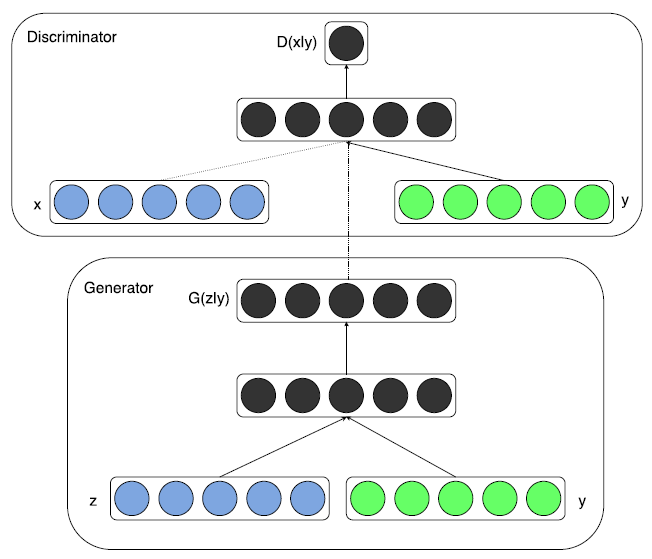

# Conditional Generative Adversarial Nets (2014)
---
generative model vs conditional generative model의 차이는 뭐고 왜 conditioned version이 필요한 건지를 위주로 파악할 것 (간단히만 읽자)

## 1. Introduction
- GAN: 기존의 generative model의 computational costs를 매우 간소화시키고, backpropagation을 통한 비교적 간단한 학습과정으로 simplified generative networks를 제안함.
- but, GAN is **"unconditioned"**
- 즉, 생성되는 데이터의 모드에 대한 컨트롤을 할 수 없다는 것.

- 추가적인 정보에 모델을 conditioning함으로써 data generation을 control할 수 있다는 점.

## 2. Related Work

### Multi-modal Learning for Image Labelling
- 기존의 접근들에는 2가지 문제가 존재함.
1. output categories가 너무 많이 존재
→ 다른 modalities로부터 추가적인 정보를 받아와서 사용하기 (leveraging additional information from other modalities)
2. input과 output을 one-to-one mapping으로 가정하고 학습을 진행 (but, rather one-to-many mappings)
→ conditional probabilistic generative models 사용 (input: conditioning variable, one-to-many mapping: conditional predictive distribution)

## Conditional Adversarial Nets
### 3.1. Conditional Adversarial Nets
GANs can be extended to a conditional model if both the generator and discriminator are conditioned on some extra information y (any kind of auxiliary information).
→ y를 discriminator와 generator에 각각 추가적인 입력으로 넣어주면 됨.

