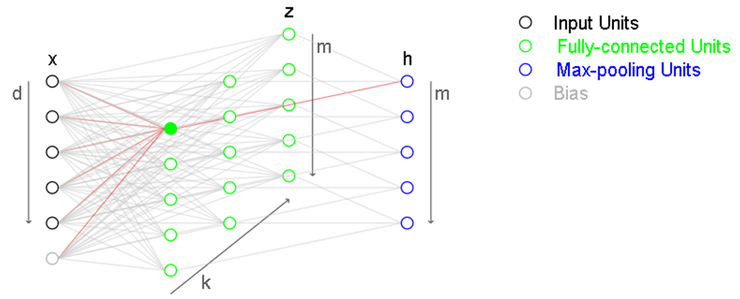
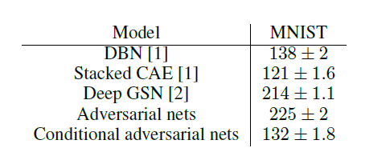
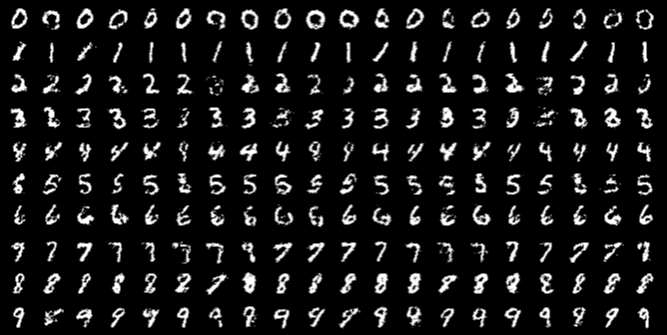

# Conditional Generative Adversarial Nets (2014)
---

## 1. Introduction
- GAN: 기존의 generative model의 computational costs를 매우 간소화시키고, backpropagation을 통한 비교적 간단한 학습과정으로 simplified generative networks를 제안함.
- but, GAN is **"unconditioned"**
  → ***즉, 생성되는 데이터의 모드에 대한 컨트롤을 할 수 없다는 것.***

- 추가적인 정보에 모델을 conditioning함으로써 data generation을 control할 수 있다는 점.

  

## 2. Related Work

### Multi-modal Learning for Image Labelling
- 기존의 접근들에는 2가지 문제가 존재함.
1. output categories가 너무 많이 존재
→ 다른 modalities로부터 추가적인 정보를 받아와서 사용하기 (leveraging additional information from other modalities)
2. input과 output을 one-to-one mapping으로 가정하고 학습을 진행 (but, rather one-to-many mappings)
→ conditional probabilistic generative models 사용 (input: conditioning variable, one-to-many mapping: conditional predictive distribution)

  

## 3. Conditional Adversarial Nets

### 3.1. Generative Adversarial Nets
consists of two 'adversarial' models: **G & D**
- A *generative* model **G** : captures the data distribution
- A *discriminative* model **D**: estimates the probability that a sample came from the training data rather than G (해당 sample이 G가 아닌 D로부터 왔을 확률, 즉 해당 sample이 genuine?)
- G는 noise z를 받아서 생성된 이미지 G(z)를 리턴
- D는 G(z) 혹은 x를 받아서 해당 샘플이 $p_g$가 아니라 $p_{data}$로부터 왔을 확률을 나타내는 single scalar값을 리턴

 

### 3.2. Conditional Adversarial Nets
GANs can be extended to a conditional model if both the generator and discriminator are **conditioned on some extra information *y*** (any kind of **auxiliary** information).
→ y를 discriminator와 generator에 각각 추가적인 입력으로 넣어주면 됨.

- backbone과 같은 경우엔 GAN과 동일하게 MLP를 사용.
- **Objective** (약간 엄밀하진 않다고 생각이 든다.)
  $$ \min_G\max_D V(D, G) = \mathbb{E}_{x\sim p_{data}(x)}[logD(x|y)] + \mathbb{E}_{z\sim p_z(z)}[log(1-D(G(z|y)))] $$

  **class label y가 주어졌을 때**, 
  → D는 x에 더불어 y라는 추가정보를 가진 상태로 해당 이미지가 실제 이미지인지 아닌지의 확률을 최대화시키는 방향으로 학습. (진짜를 진짜로 판단할 확률 가짜를 가짜로 판단할 확률을 최대화)
  → G는 y의 class 정보를 같이 학습해서 X,y의 joint representation을 학습하게 됨. (unconditioned GAN에서는 D를 잘 속일만한 이미지를 생성해내는 게 목표였다면 이번에는 잘 속일만한 이미지를 생성해내면서도, class label값을 보다 잘 반영하는 형태로 표현이 학습될 것임을 추측 가능.)

  

## 4. Experimental Results
논문에서는 unimodal과 multimodal 모두를 다루고 있으나, unimodal만 리뷰 작성.

- MNIST dataset에 학습 (conditioned on their class labels which are encoded as one-hot vectors)
   
### *Architecture of **G***
  - noise z의 차원: 100 (from uniform distribution)
  - z,y: 두 입력 모두 ReLU 활성화함수를 사용한 hidden layers로 mapping
    - 각 layer size는 200, 1000 → 이후, 두 번째 layer는 모두 1200차원의 hidden + ReLU로 매핑.
    - 마지막은 sigmoid 레이어를 통과하면서 784 차원의 mnist 샘플을 생성.
   
### *Architecture of **D***
  - maps $x$ to a maxout layer with 240 units and 5 pieces, and y to a maxout layer with 50 units and 5 pieces.
  - 이후, sigmoid layer에 들어가기 전에 240 units and 4 pieces의 maxout layer로 들어가게 됨.
  - discriminator의 구조는 일정 성능이 보장된다면 크게 중요하진 않음.
  

####  cf.) Max-out layer

    
k개의 fully connected layer (같은 k값 내에서 총 m개의 unit이 있음)가 있음 (without activation. affine layer라고 볼 수 있겠음.) 이후, 각 k개는 k개의 max pooling units로 들어가게 됨. (이를 통해 function approximation이 이루어짐 → piecewise linear approxmiation)
    
위에서 240개의 units, 5개의 piece 등으로 maxout layer를 구성했다고 되어 있는데 $m\times k=240$, $k=5$로 구성된 maxout layer라고 보면 됨.

 

### Training Details
  - SGD optimizer
  - batch size = 100
  - initial learning rate = 0.1
  - lr decay = 1.00004 → lr exponentially decreased down to .000001
  - momentum = .5 (increased up to .7)
  - Dropout with p = .5 (applied to both the generator and discriminator)
  - early stopping 적용 (best estimate of log-likelihood on the validation set)
 

### log-likelihood estimates 결과 비교
  

  - Gaussian Parzen window 방식을 사용해서 log-likelihood estimate을 비교해봄. (mnist 각 10개의 클래스로부터 1000개의 샘플을 뽑아서 수행)
  - DBN이나 Stacked CAE와는 견줄 만한 결과를 얻었으나 Deep GSN이나 non-conditional GAN보다는 성능이 좋지 않았음.
  - 이는 추후 하이퍼파라미터 혹은 아키텍처를 튜닝함으로써 개선이 될 것으로 보임.
 

### 생성 결과
  

각 row 같은 경우엔 각 클래스 0~9까지 condition으로 준 생성 결과를 의미하며, column의 경우 각각 다르게 생성된 샘플.

  

## 5. Conclusion & Future Work
- GAN의 Conditional version을 제안했다는 점에서 그 의의가 있음.
- 추후, 모델 구조를 좀 더 개선하거나 혹은 peformance나 모델 특성에 대해서 보다 깊은 분석이 가능할 것.
- 또한 language domain 등으로 확장이 가능할 것.

---
## 개인적으로 느낀 점
- Conditional GAN이 기존 GAN의 어떤 점을 보완하는지에 대해서는 확인하기 좋은 논문이었고, condition으로 할 input을 추가적으로 G와 D에 각각 넣어준다는 점에서 conditioning 문제를 간단히 해결했다고 생각함.
- 개인적으로 G 이외에 D에도 condition을 주어야하는지는 아직까진 잘 와닿지 않음.
- D의 output에 대한 정의가 조건이 주어졌다고 변하지는 않은 것으로 파악했는데 이 부분이 완벽한지는 잘 모르겠음.
- 왜 preprint에서 그친 건지 알겠음...