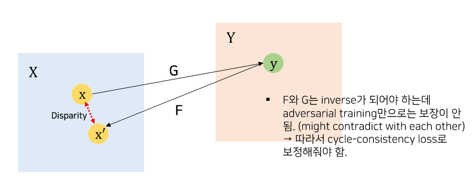

# Unpaired Image-to-Image Translation using Cycle-Consistent Adversarial Networks (ICCV 2017)
---
 

## 1. Introduction
- image-to-image translation: **이미지 쌍을 활용해** 입력 이미지와 출력 이미지 간의 mapping을 학습
- 하지만, 이미지 쌍 데이터는 그 비용이 매우 크다.
   
- 저자는 논문에서 **unpaired** image-to-image translation 방법을 제안함.
  - 하나의 이미지 collection에서 특징을 잡아내고 다른 이미지 collection으로 해당 특징을 어떻게 녹여낼 수 있을지 찾아냄. (w.o any paired training examples)
  - lack of supervision in the form of paired examples → *exploit supervision at the level of sets* (도메인을 label로 사용하겠다)
  - given one set of images in domain X and a different set in domain Y
   
- 일반적인 GAN의 training 방식은 mapping $G: X \rightarrow Y$ 를 학습하는 것. but not suitable for pairwise translation
  - 그러나 이러한 translation은 individual input x와 output y를 의미있는 방향으로 pair up되는 걸 보장하지 않음. (기존 GAN의 objective는 도메인 간의 translation을 학습하는 방향인 거지, pairwise하게 이루어지는 것은 아니기 때문. there are infinitely many mappings $G$ that will induce the same distribution over $\hat{y}$)
  - mode collapse (모든 input 이미지가 하나의 output 이미지로만 매핑되고 더이상의 최적화가 이루어지지 않는 점) 등의 최적화 문제 발생
   
- the concept of **cycle consistent**
  - exploit the property that translation should be "cycle consistent"
  : 문장 번역 시, sentence from English to French and then translate it back from Frech to English, we should arrive back at the original sentence.
  - 수학적으로 표현하자면, 두 개의 translator $G, F$가 있다고 가정하자. 이때 $G$는 $X \rightarrow Y$ 이고, $F$는 $Y \rightarrow X$ 이다. $G$와 $F$는 서로의 inverse가 되어야 하며, 각 매핑은 bijection이어야 함. (서로의 inverse여야 하기 때문일 듯)
    cf.) bijections
      두 집합 사이를 중복 없이 모두 일대일로 대응시키는 함수.
  - by training both the mapping $G$ and $F$ simultaneously, and adding a ***cycle consistency loss*** that encourages $F(G(x)) \approx x $ and $G(F(y)) \approx y$. Combining this loss with adversarial losses on domains $X$ and $Y$ yields our full objective for unpaired image-to-image translation.
  

  

## 2. Related work

  - GANs
    : adversarial training을 통해서 실제에 가까운 fake 이미지를 생성
      → CycleGAN에서는 translation의 결과가 실제 이미지와 식별이 불가할 정도의 퀄리티가 나오도록 하는 측면에서 사용할 수 있음.

  - Image-to-Image Translation
    : paired image dataset 기반의 연구가 주를 이루었으나, CycleGAN에서는 paired training example을 사용하지 않고 매핑을 학습한다는 점에서 그 의의가 있다.

  - Unpaired Image-to-Image Translation
    : unpaired setting에서의 image-to-image translation에 대한 연구 또한 이루어져왔음 (두 도메인을 relate시키는 방식)

    1. *Rosales et al.*: Bayesian framework that includes a prior based on a patch-based Markov random field
    2. *CoGAN and cross-modal scene networks*: weight-sharing strategy to learn a coimmon representation across domains
    3. *Liu et al.*: a combination of variational autoencoders and generative adversarial networks
    4. *Method of encouraging the input and output to share specific "content" features even though they may differ in "style"*
      : also using adversarial networks but added a term to enforce the output to be close to the input in a **predefined metric space** (e.g. class label space, image pixel space, image feature space)

  → 반면, CycleGAN에서는
   - **not** relying on **any task-specific, predefined similarity function** between the input and output
   - **not assuming** that the input and output have to **lie in the same low-dimensional embedding space**

  즉, 보다 유연하고 가정하는 사항들로부터 자유롭다. 이처럼 CycleGAN은 기존의 연구보다 vision task에서 일반적인 solution이 될 수 있다는 점에서 큰 의의가 있음.
   

-  ***Cycle Consistency***
   - The idea of using **transitivity** as a way to regularize structured data has a long history
   - **back translation and reconciliation** as a way of verifying and improving translations in the language domain.
   - **Zhou et al. & Godard et al.** : cycle consistency loss 사용. (to supervised CNN training)
   - **Yi et al. (DualGAN)** : independently use a similar objective for unpaired image-to-image translation (두 개의 Generator가 존재하고, cycle consistent하게 해주기 위해 각 generator가 reconstruction loss를 최소화하는 방식으로 학습함)

   → CycleGAN에서도 cycle consistency loss를 사용해서 G와 F가 서로 consistent하도록 force해줌. 

- ***Neural Style Transfer***
  : image-to-image translation을 수행하는 방법으로, 하나의 이미지 content를 다른 이미지의 style과 결합해서 새로운 이미지를 합성해내는 방법. 사전학습된 deep feature의 Gram matrix 통계량 구한 후 이를 매칭하는 방식으로 결합이 이루어짐.

  → CycleGAN에서는 두 개의 specific한 이미지 간의 mapping을 학습하는 것이 아니라 image **collection** 간의 매핑을 학습하는 것.

  좀 더 **higher-level**의 appearance structure 간의 대응을 capture하는 방식으로 수행할 것. 즉, 보다 다양한 태스크에 적용할 수 있다는 이점이 있음.
  
  
## 3. Formulation

- **GOAL**
  - learn mapping functions between two domains X and Y given training samples $\{x_i\}_{i=1}^{N}$ where $x \in X$ and $\{y_j\}_{j=1}^{M}$ where $y_j \in Y$. 
- 문제 정의
  - 데이터가 unpair된 상황에서 이미지 간 translation을 수행
  - 두 개의 mapping $G$ & $F$ (inverse of each other) + accordingly two Discriminators
  : 하나의 mapping은 highly under-constrained하므로 inverse mapping을 하나 더 정의
  - 추가적으로 cycle consistent하도록 하는 cycle consistency loss term 정의
  : ***prevent** the learned mappings $G$ and $F$ **from contradicting each other***
  - 두 개의 adversarial loss & 한 개의 cycle conssitency loss가 필요.
- notation 정리
  - $p_{data}(x)$: $x$의 data distribution
  - $p_{data}(y)$: $y$의 data distribution
  - $G$: a mapping of $X \rightarrow Y$
  - $F$: a mapping of $Y \rightarrow X$
  - $D_X$, $D_Y$: two adversarial discriminators (전자의 경우, $\{x\}$와 $\{F(y)\}$ 를 구분해내야함. 후자의 경우엔 $\{y\}$와 $\{G(x)\}$를 구분해내야.)

 

### 3.1. Adversarial Loss
  applying adversarial losses to both mapping functions

  for mapping $G$,
  $$\mathcal{L}_{GAN}(G,D_Y,X,Y) = \mathop{\mathbb{E}}_{y \sim p_{data}(y)} [log\ D_Y(y)] + \mathop{\mathbb{E}}_{x \sim p_{data}(y)} [log\ (1 - D_Y(G(x))]$$

  → 최종 objective: $\min_G \max_{D_Y} \mathcal{L}_{GAN}(G, D_Y, X, Y)$

  위의 objective를 $F$에도 동일하게 적용하면, 

  $$\min_F \max_{D_X} \mathcal{L}_{GAN}(F,D_X,Y,X)$$

 

### 3.2. Cycle Consistency Loss
  Adversarial training은 이론적으로는 mapping G와 F를 output generating function이 data distribution을 완벽히 근사할 수 있도록 학습시키는 게 가능함. 그러나 이는 모델 capacity가 충분히 크다고 가정할 때 network가 입력 이미지 셋을 target domain의 *임의의* 이미지 permutation으로 매핑이 됨을 의미한다.
  
  

  즉, adversarial loss는 학습된 함수가 개별 입력 이미지 $x_i$가 원하는 개별 출력 이미지 $y_i$로 매핑되는 걸 보장하지 않는다. 따라서 Cycle GAN의 저자는 가능한 mapping 함수의 공간을 더 줄이기 위해서(with a mere adversarial loss, **any of the learned mapping** can induce an output distribuiton) 학습된 매핑 함수가 "cycle-consistent" 해야 함을 주장한다.

  - ***Cycle Consistency***
  
  
    - $x → G(x) → F(G(x)) \approx x$의 cycle을 보장(*forward cycle-consistency*)하기 위해, $x$와 $x'(=(F(G(x)))$ 간의 간극을 줄이는 term이 cycle consistency loss 이다. 
    이는 $y → F(y) → G(F(y)) \approx y$에도 똑같이 적용(*backward cycle-consistency*)이 된다.
    - cycle-consistency loss를 이용해서 최적화가 제대로 이루어지면 $G$와 $F$는 cycle-consistent한 방식으로 mapping이 학습될 것이다.
    
  - ***Loss term***
  $$\mathcal{L}_{cyc}(G,F) = \mathop{\mathbb{E}}_{x \sim p_{data}(x)}[\lVert F(G(x)) - x \rVert _1] + \mathop{\mathbb{E}}_{y \sim p_{data}(y)}[\lVert G(F(y)) - y \rVert _1] $$ 

간단히, mapping된 값과 실제 original image 간의 L1 loss의 기댓값으로 정의. 참고로, L1-loss 대신 adversarial loss를 사용했을 때 성능의 향상이 관찰되지 않았음.

 

### 3.3. Full Objective

$$\mathcal{L}(G, F, D_X, D_Y) = \mathcal{L}_{GAN}(G, D_Y, X, Y) + \mathcal{L}(F, D_X, Y, X) + \lambda \mathcal{L}_{cyc}(G,F) $$

여기서 $\lambda$는 cycle consistency loss term과 adversarial loss term 간의 상대적인 중요도를 control하는 하이퍼 파라미터이다.

따라서 최적의 G와 F는 다음과 같이 정의된다.

$$G^*, F^* = arg \min_{G,F} \max_{D_X, D_Y} \mathcal{L}(G,F,D_X,D_Y)$$

추후 5장에서 loss의 term에 대한 ablation study를 거치며 loss의 정당성을 살펴볼 예정.

 

#### Autoencoder관점에서의 CycleGAN
논문에서 제시한 모델은 두 개의 autoencoder를 학습하는 것으로도 볼 수 있는데, 이는 각 매핑을 합성할 경우에 결국에는 자기 자신을 복원하는 형태이기 때문이다. 하지만, 주목할 점은 이러한 autoencoder의 내부 구조를 보았을 때 intermediate representation이 다른 domain으로의 translation하는 형태라는 점이다. 

Adversal training을 거친다는 점에서 adversarial autoencoder의 특징을 보인다고 할 수 있다. 보다 구체적으로 말하면, CycleGAN의 경우 임의의 target distribution을 대응시키기 위해서 adversarial loss를 활용해서 autoencoder의 bottleneck layer를 학습시키는 형태의 adversarial autoencoder라고 할 수 있다. 이 경우 X를 복원시키는 autoencoder의 target distribution은 Y가 된다.

→ 즉, "cycle" = reconstruction ⇒ autoencoder로 볼 수 있다. 다만 latent space(혹은 target distribution)이 target domain Y라는 점이다. (or vice versa)

  

## 4. Implementation

### Network Architecture

  **1. Generator**
  - 3개의 convolution layer
  - several residual blocks
  - 2 fractionally-strided convolutions with stride = $\frac{1}{2}$
  - one convolution that maps features to RGB
  - 6 blocks for 128 X 128 images and 9 blocks for 256 X 256 or higher-resolution images
  - instance normalization

  **2. Discriminator**
  - *70 X 70 Patch GANs* : 70 X 70 크기의 overlapping 이미지 패치를 구성하고, 해당 패치에 대한 진위여부를 판별하는 discriminator 구조
  - 이러한 *Patch-level discriminator*은 전체 이미지를 입력으로 받는 discriminator에 비해 적은 파라미터를 갖고, fully convolutional한 구조를 가져서 임의 사이즈의 이미지에도 대응이 가능하다.

### Training Details
1. 학습 안정성 제고를 위한 2가지 방법
   - Mod to adversarial Loss $\mathcal{L}_{GAN}$
     - NLL이 아닌, **least-squares loss**를 사용함.
     - 학습 과정 중 보다 안정적인 양상을 보여주고, 보다 양질의 이미지를 생성할 수 있었음
     - train G to minimize $\mathop{\mathbb{E}}_{x \sim p_{data}(x)}[(D(G(x)) - 1]^2$
       - 가짜를 진짜로 판별할 확률과 1값의 차이를 줄여나간다, 즉 가짜를 진짜로 판별할 확률을 maximize하는 것과 다름 없음.
     - train D to minimize $\mathop{\mathbb{E}}_{y \sim p_{data}(y)}[D(y) - 1]^2 + \mathop{\mathbb{E}}_{y \sim p_{data}(x)}[D(G(x))]^2$
       - 진짜를 진짜로 잘 판별해내고 (앞의 term), 가짜를 진짜로 판별해낼 확률을 줄여감(뒤의 term)

   - 가장 최근의 generator가 아니라, 모든 생성된 이미지의 history를 다 이용해서 discriminator를 학습시킨다. 이를 위해 최근 생성된 이미지 50개를 저장할 수 있는 이미지 버퍼가 필요함.

2. 하이퍼 파라미터 설정
   - $\lambda = 10$으로 설정
   - Adam solver 사용
    - batch size = 1
    - learning rate = 0.0002
    - 100 에폭 학습 후 나머지 100 에폭은 점점 learning rate을 0에 가깝게 줄여나간다.
  

## 5. Results
  1) 최근의 다른 unpaired image-to-image translation 방법론과의 비교 (on paired datasets)를 통해 모형의 성능 평가
  2) Loss에 대한 ablation study를 통해 adversarial loss와 cycle consistency loss의 중요도 평가
  3) paried dataset이 없을 경우의 알고리즘 활용성을 위한 알고리즘의 확장성 (generality)에 대한 평가

### 5.1. Evaluation
pix2pix와 동일한 방법으로 정량적, 정성적 평가를 수행하고 이를 여러 베이스라인과 비교. 
- tasks
  - semantic labels ↔ photo on the Cityscapes dataset
  - map ↔ aerial photo on data scraped from Google Maps
  - ablation study on the full loss function
  
#### 5.1.1. Evaluation Metrics
- AMT Perceptual studies (정성적)
  - map ↔ arial photo에 대해서 적용
  - 25명의 participant에게 이미지가 진짜인지 아닌지 판단하도록 함.
  - 베이스라인과의 비교를 수행.
- FCN score (정량적)
  - Cityscapes labels → phto task
  - evaluates how interpretable the generated photos are according to a FCN
  - FCN은 생성된 사진에 대해 label map을 예측해서 input ground truth labels과 비교
    - 즉, 라벨값을 바탕으로 G는 사진을 생성하고 이를 다시 FCN을 통과해서 label을 예측함. 생성이 잘 되었다면 동일한 label을 리턴할 것임.
  
#### 5.1.2. Baselines
- CoGAN
  - one GAN generator for domain X and one for domain Y with tied weights on the first few layers for shared latent representations (weight을 공유하는 형태 for 잠재 표현 공유)
  - 이미지 X를 생성하는 latent representation을 찾고 이를 Y의 스타일로 렌더링하는 형태
- SimGAN
  - 도메인 간 translation을 위해 adversarial loss를 사용. 
  - pixel 레벨에서 큰 변화를 주는 것에 페널티를 주기 위해 regularization term $\lVert x - G(x) \rVert _1$를 더해줌
- Feature loss + GAN
  - a variant of Sim-GAN (RGB pixel value가 아닌, 사전학습된 네트워크에서 image features를 추출해서 L1 loss가 계산됨) → perceptual loss
- BiGAN/ALI
  - 원래는 unconditional GANs with inverse mapping
  - 실험에서는 conditional setting으로 임의로 바꿔 성능 비교 진행
- pix2pix
  - trained on paired data
  - used to see how close CycleGAN can get to this "upper bound" without using any paired data

변인통제를 위해 CoGAN을 제외하고는 backbone과 training detail은 모두 고정하여 실험을 진행함. (CoGAN의 경우에는 image-to-image network의 구조가 아니라 환경을 통일할 수 없었음)

#### 5.1.3. Comparison against baselines

- Cityscapes test

- map↔area test

생성된 결과물을 시각화한 결과. unpaired setting에서의 baseline은 모두 CycleGAN에 비교되는 성능을 보여주지 못했음. 반면, CycleGAN은 paired setting에서 학습된 pix2pix에 견줄 만한 성능을 보여주고 있음.

- 성능 비교표

역시 다른 unpaired image-to-image translation 알고리즘보다 월등한 성능을 보여주고 있고, pix2pix에 가장 가까운 성능을 보여주고 있다.

#### 5.1.4. Analysis of the loss function

- 정량 평가

- 정성 평가

full loss term에서 다양한 variants를 주면서 FCN score를 비교. GAN loss 혹은 cycle-consistency loss를 제거하면 성능의 심각한 저하를 야기함. 
cycle-consistency loss의 방향에 대한 실험을 진행한 결과, labels to photo의 경우에는 양방향 loss가 다 추가된 경우보다 forward cycle만이 추가된 경우가 조금 더 높았으나, 정성적으로 결과를 시각화해본 결과 mode collapse와 training instability가 발생함을 알 수 있었다.

#### 5.1.5. Image reconstruction quality

training과 testing time 모두 복원된 이미지가 실제 input과 종종 비슷. map ↔ aerial 의 경우에는 하나의 도메인(map)이 나머지 도메인(aerial)보다 훨씬 더 다양한 정보를 담고 있음에도 불구하고 어느 정도 복원이 잘된 것을 알 수 있다.

#### 5.1.6. Additional results on paired datasets

CMP Facade Database & UT Zappos50K (pix2pix의 학습데이터셋)를 입력으로 한 생성 결과이다. supervised setting에서 학습된 모델과 거의 비슷한 결과 퀄리티를 보여준다는 점이 인상적이다.

### 5.2. Applications
paired dataset이 없는 다양한 세팅에서 모델을 적용

- Collection style transfer
  - landscape 사진을 Flickr와 WikiArt에서 수집해서 사용 (from landscape to art)
  - neural transfer와 다르게 "이미지" 간의 변화가 아니라 "image collection" 간의 변화
  - 반 고흐로 변화를 시키는 거지, starry night으로 변화 시키는 것이 아님
  - 데이터셋 크기는 화가 당 대략 400, 500, 600, 1000장
- Object transfiguration
  - translate one object class from ImageNet to another (클래스 당 1000장의 이미지 학습) 
- Season transfer
  - trained on 854 winter photos and 1273 summer photos of Yosemite downloaded from Flickr.
- Photo generation from paintings
  - loss term을 추가해서 보다 생성 성능을 향상시킬 수 있었음. (color 구성 정보를 잘 보존하는 방향으로)
  - identity loss (y ↔ G(y), x ↔ F(x))
- Photo enhancement
  - smartphones 수준 to DSLR 수준
- Comparison with Gatys et al.
  
  - photo stylization에 있어서 neural style transfer와 비교를 수행함.
  - neural style transfer의 경우에도 target domain의 gram matrix를 평균 내서 collection 단위로 transfer를 수행해봄.
  - CycleGAN이 더 좋은 생성 결과를 보여주었음.

## 6. Limitations and Discussion
- 항상 안정적으로 좋은 결과를 보여주진 않았다. 종종 failure case를 보여줌. 

### failure case 분석

- color나 texture의 change는 잘 학습을 했으나, 비교적 큰 변화인 geometric change (i.e. from dog to cat)의 경우에는 제대로 학습이 되지 않음.
- 논문에서는 모델 구조가 appearance change에 맞춰 구성되어 있다는 점을 이유로 추측하고 있음.
- appearance 변화의 경우에도, 학습 데이터셋의 distribution 특성에 따라 실패하는 경우가 종종 발생.
  - 예를 들어, horse to zebra와 같은 경우엔 학습 셋이 야생에서의 동물을 주로 담고 있기 때문에 사람이 타고 있는 말 등의 모습은 제대로 다루지 못하는 경우가 발생함.
- unsupervised learning으로서의 한계
  - supervised setting에서의 translation network보다 성능 저하가 두드러졌음.
  - 이러한 성능 차이는 해결하기가 매우 어려움.
    - weakly supervised or semi-supervised learning의 방법을 사용하는 등으로 해결해볼 수 있음

그럼에도 불구하고 unsupervised setting에서 image to image translation의 성능을 크게 높였을 뿐 아니라, 보다 다양한 application이 가능해졌다는 점에서 그 의의가 큼.
