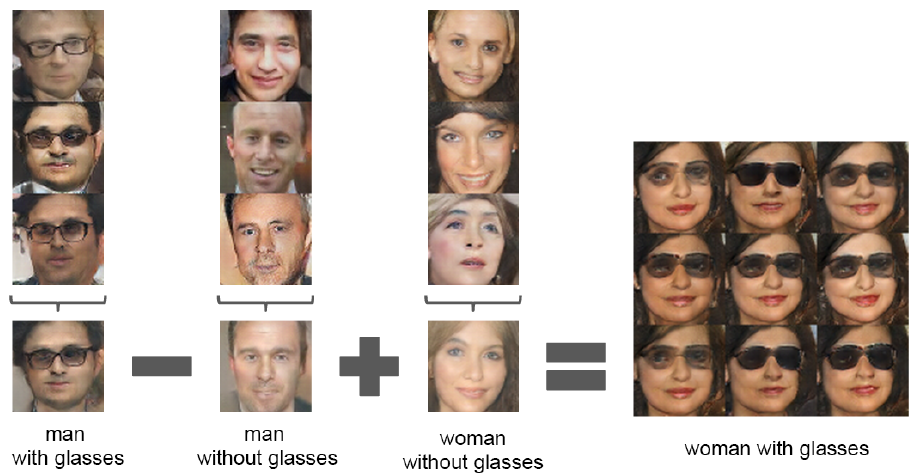

# Unsupervised Representation Learning with Deep Convolutional Generative Adversarial Networks (ICLR 2016)
---
 
## 1. Introduction
- GAN을 학습시키면서 good image representation을 구축하는 방법을 제안함. 이후 Generator(이하 G)와 discriminator(이하 D) 네트워크의 일부분을 지도학습의 feature extractor로 재사용하는 방법을 제안.
- 기존 GAN의 경우에는 불안정한 학습으로 인한 이상한 출력을 생성한다는 단점이 존재했음. (DCGAN에서는 이러한 단점을 개선)
- GAN의 학습을 이해하기 위해 직접 GAN의 학습과정 및 중간 representation을 시각화.
 
#### Contributions
저자는 논문의 contribution으로 다음의 네 가지를 제시함.
- **Stable training process**: GAN의 학습 안정성을 높인 Convolutional GANs 구조를 제안 (DCGANs)
- **Intelligent Image Classifier**: 이미지 분류를 위해 D를 학습 → 이 경우 다른 비지도학습 기반 알고리즘보다 더 높은 성능을 보여줌.
- **Visualizing GANs**: GAN의 convolution 필터를 visualize & 특정 필터가 특정 물체를 그리도록 학습됨을 경험적으로 보여줌.
- **G's vector arithmetic properties**: 생성된 샘플의 semantic quality를 쉽게 조작할 수 있도록 하는 vector arithmetic properties를 발견함.
  

## 2. Related Works
### 2.1. Representation learning from unlabeled data
- Clustering (e.g. K-means): classification score를 개선하기 위해 cluster를 활용함.
  - Hierarchical clustering of image patches (Coates & Ng, 2012)
- Auto-encoder 기반
  - Vincent et al. (2010): convolutional + stacked auto encoder
  - Zhao et al. (2015): separating the what and where components of the code
  - Rasmus et al. (2015): ladder structures that encode an image into a compact code, and decode the code to reconstruct the image as accurately as possible. (하나의 code로 contract시키고 자기자신을 복원;reconstruct하는 방향으로 학습)
- Deep Belief Networks (Lee et al., 2009): good performance in learning hierarchical representations
 
### 2.2. Generating Natural Images
generating natural images  of the real world have had not much success until recently.
- non-parametric
  - matching from a database of existing images, often matching patches of images, and have been used in texture synthesis, super-resolution and in-painting
  
- Parametric
  - VAEs (Kingma & Welling, 2013)
    - 어느 정도 이미지 생성에 성공적이었으나, blurry sample의 문제가 발생함.
  - Iterative forward diffusion process (Sohl-Dickstein et al., 2015)
  - Generative Adversarial Networks (Goodfellow et al., 2014)
    - also suffered from being noisy and incomprehensible.
  - A laplacian pyramid extension to GANs (Denton et al., 2015)
    - showed higher quality images, but they still suffered from the objects looking wobbly because of noise introduced in chaining multiple models.
    - recurrent network approach (Gregor et al., 2015) & deconvolution network approach (Dosovitskiy et al., 2014)
      - supervised tasks에 generator를 활용하지 않았음. (이 논문에서는 introduction에서 밝혔다시피 parts of generator and discriminator → feature extractor at supervised taksks)

  
### 2.3. Visualizing the Internals of CNNs
  - Zeiler & Fergus (2014) showed that by using deconvolutions and filtering the maximal activations, one can find the approximate purpose of each convolution filter in the network. (deconvolution과 maximal activation을 통해서 각 필터의 대략적인 목적을 파악할 수 있다)
  - Mordvinstev et al. showed that using a gradient descent on the inputs lets us inspect the ideal image that activates certain suvsets of filters. (gradient descent를 통해서 filter activation을 추적할 수 있다)

  
## 3. Approach and Model Architecture
### Architecture

generator의 경우 fractional-strided convolution을 이용해서 expand하는 형태이고, discriminator의 경우에는 contract하는 구조로 되어 있음.
 
 GANs를 cnn을 이용해서 scale up하는 게 그다지 성공적이지 못했음. 기존의 지도학습에서 사용되는 cnn 아키텍처를 계승해서 GANs를 scale하는 데에 문제가 있었음. 이러한 문제를 해결하는 데에는 다음과 같은 방법을 사용함.

  1. **No Pooling**: Replace any pooling layers with strided convolutions (discriminator) and fractional-strided convolutions (generator)
  2. **No FC**: Remove fully connected hidden layers for deeper architectures
  3. **Batch Normalization** both in the generator and discriminator
  4. **Activation Strategies**
      - ReLU Activation in generator for all layers but the output 
      - LeakyReLU activation in the discriminator for all layers

 
### 3-1. No Pooling
결정된 값의 pooling layer를 쓰는 것이 아니라, convolution layer로 spatial pooling을 수행함으로써 네트워크가 spatial upsampling을 **학습할 수 있도록** 하는 것. (Sprigenverg et al., 2014의 all convolutional net의 아이디어에서 착안)
 

### 3-2. No Fully Connected Layer
기존의 neural network 구조는 CNN으로 feature extraction을 수행하고, FC로 discriminating을 하는 구조였음. (fully connected layers on top of convolutional features) 하지만 이처럼 fc layer를 달고 나오는 것이 아닌 아예 fully convolutional network architecture로 바뀌는 것이 추세임. **이에 DCGAN은 highest convolutional feature를 G의 input과 D의 아웃풋에 바로 붙여 넣는다. (??)**

GAN의 첫번째 레이어는 input noise Z에 대해서 FC 연산을 수행하기는 하지만, 이는 곧 4d tensor로 reshape을 거쳐 convolution stack의 start로 이용된다. Discriminator 같은 경우에는 마지막 convolution 레이어 아웃풋이 flatten되어서 single sigmoid output으로 들어가는 구조.

(이 부분은 그림을 그려봐야 더 자세히 알 것 같음)
 

### 3-3. Batch Normalization
학습 안정성을 높이는 하나의 방법으로, 각 유닛에 들어가는 입력값을 zero mean and unit variance를 갖도록 정규화하는 방법이다. 따라서 초기화가 적절하게 이루어지지 않았을 때나 model의 깊이가 깊어질 때 gradient flow를 좀 더 잘 흐를 수 있도록 해줌. G의 초기학습을 잡아주고 mode collapse 문제를 최대한 방지하는 데에 힘씀. DCGAN 논문에서는 모든 레이어에 batchnorm을 적용할 경우 sample oscillation과 model instability 문제가 발생함을 지적하며, G의 output layer와 D의 input layer를 제외한 모든 레이어에 batchnorm을 적용.
 
### 3-4. Activation Strategies
bounded activation을 사용할 경우 모델이 training distribuiton의 color space를 더 빠르게 학습하고 더 빠르게 saturate되는 방식으로 학습이 이루어짐을 발견. 따라서 D 같은 경우엔 leaky ReLU를, G에서는 ReLU를 사용함 (output layer 제외하고).
  

## 4. Training Details

- No Pre-processing besides scaling to the range of tanh activation $[-1, 1]$
- SGD with batch size of 128
- weight init: zero-centered normal with s.t.d 0.02
- Leaky ReLU: slope = 0.02 with leak
- Adam Optimizer with learning rate = .0002
  - momentum $\beta_1$ = 0.5 ($\because$ training oscillation and instability with $\beta_1$ of 0.9)
 
### 4.1. LSUN
생성모델의 아웃풋의 visual quality가 증가하면서, over-fitting과 training samples의 memorization 문제가 대두됨. DCGAN이 데이터의 양과 sample의 resolution이 증가(향상)하는 상황에도 잘 대처할 수 있음을 보여주기 위해 300만장의 LSUN 데이터셋을 활용함.
이때, data augmentation은 적용하지 않음. 

+) 강조하고 있는 점은 small learning rate과 SGD 방식을 사용하면서 단순히 training image sample을 기억하는 것에서 벗어날 수 있었다...인 듯함.
 
#### 4.1.1. Deduplication
G가 단순히 training example을 기억해서 모방하는 현상을 방지하기 위해, 간단한 이미지 중복제거 단계를 거침.
중복 제거를 위해 3072-128-3072 (입출력 차원 3072, latent 차원: 128)의 DAE (Denoising Autoencoder with dropout regularization + ReLU activation)를 fitting시킴. 

결과적으로 latent code 레이어를 ReLU activation을 통해서 quantize시킴으로써 semantic hasing을 수행 (이를 통해 중복 제거를 linear time, 즉 $O(n)$에 수행. 아마 해싱의 최악 시간복잡도가 O(K)임에서 비롯되지 않았을까 싶음) → 간단히 해시 충돌에 대해 Visual inspection을 수행한 결과, 추정된 FPR(False Positive Rate)이 0.01 미만으로 높은 정확도를 보여주었음. 실제로 적용해본 결과 대략 275,000개의 중복을 제거하면서 비교적 높은 recall 값을 가질 것을 시사함.

cf.) semantic-hashing
: encode the semantics of an image into a binary vector called a hash code
(추측컨대, 이미지 semantic을 해싱 키로 사용하고 value를 이미지로 매칭해서 중복 제거를 꾀한 듯함. 해당 해시테이블에서 collision이 일어난다는 것은 이미지 중복이 일어난다는 뜻이므로)

 
### 4.2. Faces
scraping을 통해서 이미지 수집 후 face detection을 통해 최종적으로 35만개의 face box를 얻어냈음. 이때도 data augmentation은 수행하지 않음.
 
### 4.3. ImageNet-1K
32x32 resized center crops를 사용해서 이미지를 학습시키고, 역시 data augmentation은 적용되지 않았음.

  
## 5. Empirical Validation of DCGANs capabilities

### 5.1. Classifying CIFAR-10 using GANs as a feature extractor

unsupervised representation learning의 성능을 평가하기 위해서 CIFAR-10 데이터셋의 classification을 수행함 (feature extraction으로 GANs를 활용하고, 이후 linear classifier로 classification을 수행하는 방식)
D (pretrained on ImageNet-1K)의 모든 레이어로부터 convolutional features를 사용하되 이를 maxpooling을 거쳐 4x4의 grid로 만들어줌. 이후, flatten & concat을 거쳐 L2-SVM classifier로 최종 classification을 수행하게 된다.
아래는 K-means based representation learning algorithms과 exemplar cnn과의 비교이다. 참고로 위의 알고리즘은 모두 unsupervised representation learning 방식(pretrained on CIFAR-10)이다.
 

 
위의 테이블에서 보면 알 수 있듯이, 기존의 높은 성능을 보였던 baseline인 1-layer K-means 방식보다 약 2.2% 높은 accuracy를 보여주고 있음. baseline에 여러 변주를 준 알고리즘보다도 높은 성능을 보여주고 있음을 알 수 있다. 하지만, exemplar cnn보다는 낮은 accuracy를 보여주었다. 하지만 exemplar cnn의 경우에는 cifar-10 dataset에서 사전학습되었다는 점 + data augmentation을 거치고 data select 과정에서 개입이 많이 되는 등의 이점이 있었음.

 
### 5.2. Classifying SVHN DIGITS

이 절에서는 라벨링된 데이터가 굉장히 적은 상황에서 D의 feature를 사용하는 경우를 살펴본다.

10000장의 이미지를 validation set으로 구성하여 모델과 하이퍼파라미터 최적화에 사용함. 5.1절에서와 동일한 구성으로 feature extraction + classification pipeline을 구축. 1000개의 클래스가 uniformly distributed된 training examples를 활용하여 학습 진행.

이 경우에는 22.48%의 test error를 보이며 SOTA를 기록했으며, DCGAN의 backbone architecture가 성능의 중요 요소가 아님을 보였음. 실제로 backbone architecture만을 supervised way로 학습시켰을 때 28.87%로 더 높은 validation error를 보여줌.

  
## 6. Investigating and Visualizing the Internals of the networks

### 6.1. Walking in the latent space
모델이 학습한 manifold를 살펴봄. GAN에서 주의해야할 점인 memorization & hierarchical collapse의 sign을 살펴볼 수 있음. 실제로 manifold 상에서의 좌표 움직임이 image generation의 semantic에도 차이가 있음을 알 수 있었다. 즉, 모델이 실제로 관련이 있고 흥미로운 data representation을 학습했음을 알 수 있었음.

실제로 manifold 상에서의 9개의 random points 간을 interpolation한 결과 그럴 듯한 이미지 변화 양상(일관적이면서도 smooth transition)을 볼 수 있었음.
 
### 6.2. Visualizing the discriminator features
guided backpropagation을 통해 D의 feature map을 시각화한 결과, 실제로 침대나 창문 등 전형적인 침실의 특징 부분이 활성화된 것을 알 수 있었음.

 
### 6.3. Manipulating the generator representation

#### 6.3.1. Forgetting to draw certain objects
G가 어떤 표현을 학습했는지에 대해 알아보기 위함. generator로부터 window를 아예 지워보고자 실험 수행.

150개의 샘플을 대상으로 52개의 window bounding box를 직접 그림. 이후, 뒤에서 2번째의 convolution layer에서 logistic regression을 수행해서 feature activation이 window에 있는지 아닌지를 판별. 이후 window에 activate된 feature는 모두 삭제함. 

결과를 살펴보면, 다른 비슷한 (침실에서 등장할 법한) object들로 대체됨을 알 수 있음.

이미지의 퀄리티는 조금 떨어지는 현상이 있었지만, 실제로 창문이 문이나 거울 등으로 대체되는 등 G가 이미지 scene의 semantic이 object semantic과는 분리되어 학습하였음을 알 수 있었다.

#### 6.3.2. Vector Arithmetic on face samples

word embedding 시 vector 간 연산으로 representation이 잘 되었는지를 확인하는 방법을 face generation에도 그대로 적용. 

하지만 하나의 sample 단위로 수행하면 결과가 좋지 않아서 각 컨셉 (여성/남성, 안경/안경 없음 등) 별로 Z를 평균하여 벡터 연산을 수행한 결과 안정적인 생성 결과가 나올뿐 아니라 실제로 연산의 결과와 부합하는 생성 결과가 나왔다.

이러한 벡터연산을 통해 unsupervised model에서도 conditionally generation이 가능하다는 것을 동시에 보여주고 있음.

  
## 7. Conclusion and Future Work

#### Contributions
  - propose a **more stable set** of architectures
  -  give evidence that **adversiaral networks learn good representations of images** for supervised learning and generative modeling (*representation learning 측면에서 좋은 성능*)
   
#### Limits and Future works
  - 남아있는 model instability
    : 모델이 학습될 수록 가끔씩 convolution filter 중 일부분이 값이 진동하는 현상이 발생 (collapse a subset of filters to a single oscillating mode)
  - 다른 분야로의 확장 such as video and audio.

---
#### 개인적으로 느낀 점
구조 자체가 특별한 점은 없었다. 다만 gan을 cnn backbone으로 바꾸는 데에 있었던 여러 학습 불안정성을 당시 추세에 맞게 여러 요소들을 접목시켜서 해결했다는 점이 논문에서 내세우는 하나의 contribution이었다.

개인적으로 이 논문은 수식적으로 특별한 loss를 제안하거나 architecture를 제안한 것은 아니지만 representation에 대해서 여러 실험을 진행했다는 점이 새롭게 다가옴. 
