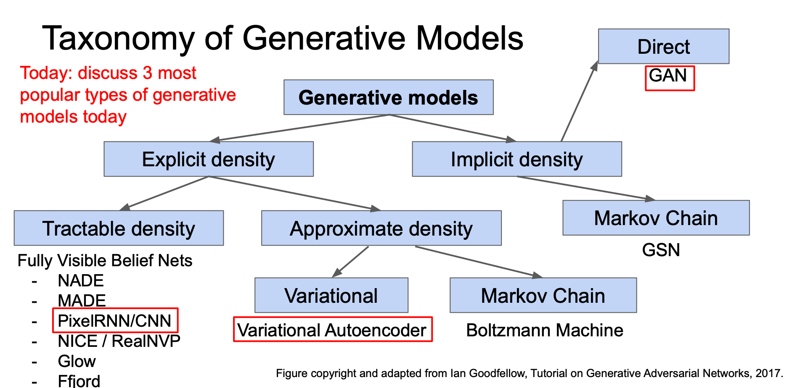
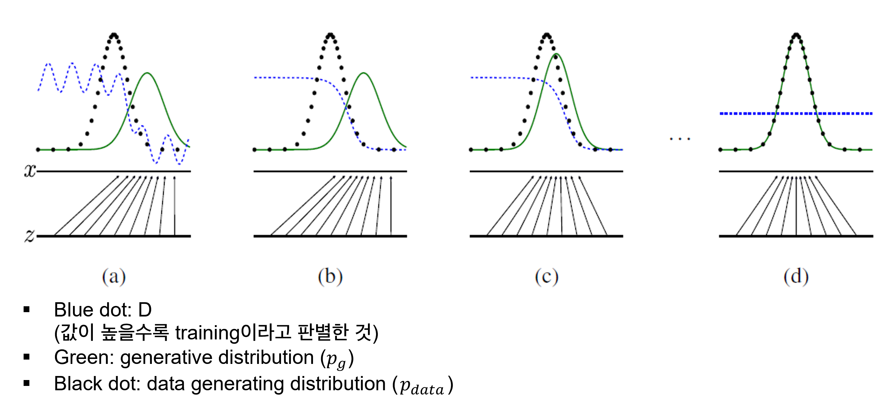
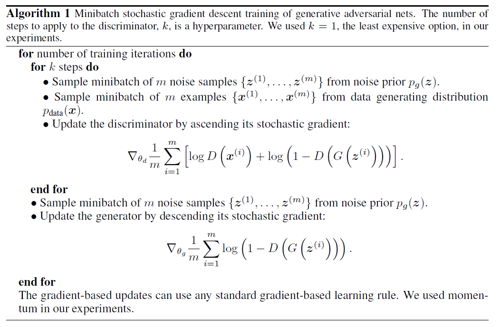
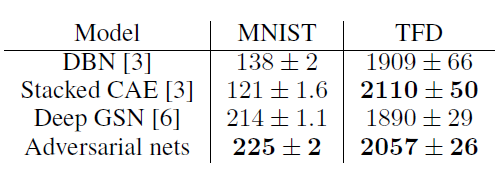
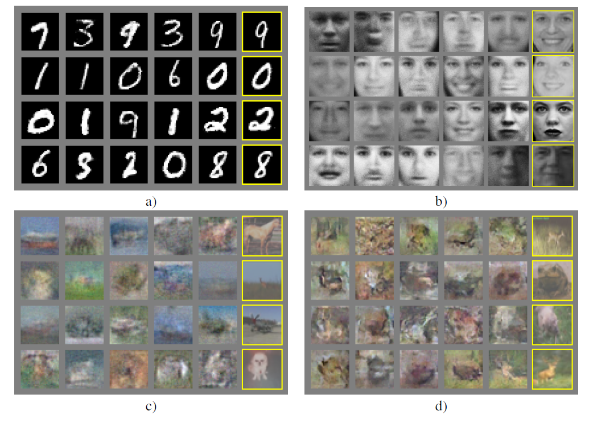

# Generative Adversarial Networks (2014)
---
 

## 1. Introduction
- deep learning이 Discriminative task에서 괄목할 만한 성과를 보이고 있음
- 그러나 generative models에서는 크게 다음과 같은 두 가지 이유때문에 deep learning의 적용이 어려움

    1) *difficulty of approximating many intractable probabilistic computations*
    2) *difficulty of leveraging the benefits of piecewise linear units* (while it contributes a lot in the discriminative context)
   
위의 두 가지 어려움을 극복한 generative model estimation procedure를 제안함. 
→ ***Adversarial Nets*** framework

- adversarial nets framework?
  - two-player game (two agents are each generator and discriminator)
  - 생성자 G (이하 G)는 데이터의 분포를 학습하고 샘플은 생성해고, 판별자 D (이하 D)는 해당 샘플이 dataset으로부터 온 것인지 아님 model이 생성해낸 결과인지를 판별해내는 과정이 지속적으로 이루어지는 구조.
  - 두 모델 간의 경쟁방식은 D가 진짜와 가짜를 구분할 수 없을 때까지 계속 D와 G의 성능이 향상되도록 학습을 이끌어나감.

- 논문에서는 G가 random noise를 입력으로 받아 샘플을 생성해내는 과정과 D가 이를 판별해내는 과정을 모두 multilayer perceptron으로 구현함. → *Adversarial Nets*
- 이를 통해 architecture의 학습 과정은 backpropagration과 dropout 알고리즘만을 활용하여 학습이 가능해지고, 이전의 approximate inference 혹은 markov chain 등의 과정은 필요하지 않게 됨.

## 2. Related Work (reference를 얼마나 공부해야될지?)

- undirected graphical models with latent models (such as Resricted Boltzmann machines, deep Boltzmann machines)
  - this quantity and its gradient are **intractable** for all but the most trivial instances
- hybrid models (such as Deep belief Networks)
  - single undirected layer + several directed layers
  - undirected와 directed model이 갖는 computational difficulties를 모두 갖게 됨.
- score matching and noise-contrastive estimation (NCE)
  - do not approximate or bound the log-likelihood
  - 위 종류의 모델에서는 학습한 확률 밀도를 정규화된 상수로 해석적으로 명시 가능한 형태로 표현해야 함. 그러나 대부분의 경우 잠재 변수로 구성된 여러 개의 layer를 쌓은 모델은 계산이 가능한 형태의 정규화되지 않은 확률 밀도를 유도해내는 것 자체가 불가능함.
  - **NCE** 같은 경우에는 **생성 모델을 fitting하는 데에 discriminative training criterion을 적용**. 하지만 별도의 discriminative model을 사용한 것이 아니라 generative model 내에서 판별을 수행한다는 점 & 고정된 noise distribution을 사용하기 때문에 학습이 굉장히 느리다는 점 (느리다는 게 주안점인 건지 아니면 학습이 이상한 방향으로 빠질 수 있다는 게 주안점인 건지는 모르겠음)
- implicit density model (such as GSN)
  - 확률 밀도를 명시적으로 정의하지 않고 생성 모델을 원하는 distribution에서 sampling 가능하도록 학습시키는 방식
  - 역전파가 가능하다는 점에서 good
  - parameterized Markov Chain
  - GAN은 sampling에 있어서 markov chain을 요구하지 않는다는 점에서 이점이 있음.
  
## 3. Adversarial Nets
- Architecture

Generator는 random input을 받고 생성을 하고, discriminator는 생성된 이미지와 진짜 이미지를 인풋으로 받아서 해당 샘플이 진짜인지 아닌지 판별하게 됨. 이후 discriminator loss를 계산 후, k번 gradient ascending을 수행하고 그 후에 generator는 generator loss를 계산 후 gradient descent 수행.
→ 간단하게 말하자면, D는 잘 판별하고 G는 D를 잘 속여야함.

- 용어 정리
  - $p_g(x)$: generator's distribution
    -  **Q. 왜 $p_g$가 data $x$에 대해 distribute되는지?**
  - $p_z(z)$: a prior distribution on input noise variables $z$
  - $G(z;\theta_g)$: a mapping to data space, where G is a differentiable function represented by a MLP with parameters $\theta_g$
  - $D(x;\theta_d)$: another MLP that outputs a single scalar. It represents the probability that x came from the data rather than $p_g$.
  
 

- GAN Objective (Eq. 1 → why expectation?)

$$ \min_{G} \max_{D} V(D,G) = \mathop{\mathbb{E}}_{x{\sim}p_{data}(x)}[log D(x)] + \mathop{\mathbb{E}}_{z{\sim}p_z(z)}[log(1-D(G(z)))]$$

위의 식을 설명하면, D가 진짜를 진짜라고 판별할 로그 확률의 기댓값 + D가 가짜를 가짜라고 판별할 로그 확률의 기댓값 으로 설명할 수 있다.
D의 경우에는 위의 식을 최대화해야하고, G의 경우에는 $\mathop{\mathbb{E}}_{z{\sim}p_z(z)}[log(1-D(G(z)))]$ 를 최소화해야 함. 학습은 동시에 수행된다. (minimax two-player game)
 

- Alternating training

  - Optimizing D to completion: computationally expensive & might cause overfitting
  - Solution: D와 G를 k:1로 최적화시킴 (D가 k번 step을 밟을 때 G는 1번만 밟는 식)
  - D가 optimal solution 근처에서 유지될 뿐 아니라 G가 천천히 바뀔 수 있음. (SML/PCD에서 착안)

 

- A slight modification to the Generator Loss
  - 기존의 Generator loss(Eq 1)는 G가 충분히 학습될만큼의 Gradient를 제공해주지 못할 것.
  - 그 이유는 학습 초기에 G의 성능이 좋지 못할 때 D가 너무 빨리 generated sample을 reject할 것이기 때문 (G의 product와 기존 학습 데이터는 확실히 다르기 때문에 TN 케이스가 너무 쉬워져 버림)
  - 이렇게 되는 경우 $log(1-D(G(z)))$ 가 saturate되어 버림. (saturate된다는 것은 기울기가 0에 가까워지면서 gradient가 발생하지 않게되고 가중치 update가 이루어지지 않는다는 것)
  - 따라서 TN케이스를 다루는 것이 아니라 FN케이스를 다루도록 문제를 reformulate하는 것. (최소화 → 최대화)
  - 아주 간단히 이루어질 수 있음. 기존의 G의 학습 방향이 $log(1-D(G(z)))$을 최소화하는 방향으로 이루어졌다면, $log(D(G(z)))$를 최대화하는 방향으로 바꾸는 것.
  - 전체적인 학습 과정에서 수렴지점은 변하지 않으나 학습 초기 단계에서 그래디언트를 더 크게 가져갈 수 있음. → 학습 초기 saturation 현상의 방지

 

-  학습 과정

어느 정도 학습이 진행된 상태임을 상정함. (a)에서는 discriminator가 부분적으로는 잘 판별을 하고있음을 알 수 있음. (black dotted > green일 때 blue dotted line도 어느 정도 높은 값을 갖는 경향이 있고, green < black의 경우 blue도 어느 정도 낮은 값을 갖고 있음.)

여기서 볼 점은 z를 x로 변환하고 있는 mapping G가 directed arrow로 표현이 되어 있음. ($x=g(z)$이 성립 for all x, z) 초기단계에는 제대로 학습이 되지 않았기 때문에 mapping g로 인해 변환된 x가 실제 $p_{data}$의 mode보다 살짝 오른쪽에 위치해있기 때문에 $p_g$ 또한 살짝 오른쪽에 치우쳐져있음.

학습이 진행되면서, discriminator는 점점 flat해지는 형태로 학습이 되어감 (즉, 진짜와 가짜를 제대로 구별해내지 못하게 됨). G의 경우에는 mapping G가 어느 정도 $p_{data}$의 mode쪽에 근접한 형태로 학습이 되고 있음. 이에 따라 $p_g$ 또한 모양이나 mode 모두 $p_{data}$에 맞춰서 변화해나감을 알 수 있음.

따라서 최종적으로는 $p_g$ = $p_{data}$가 되고, discriminator D는 $\frac{1}{2}$의 확률값을 가지는 uniform distribution의 형태를 보이게 됨. → 이론적인 unique solution

## 4. Theoretical Results
G는 묵시적으로 확률분포 $p_g$를 정의함. 해당 확률분포는 확률변수 $z$가 $p(z)$를 따를 때 G(z)로부터 파생된 샘플들의 분포임을 밝힘. 즉, 확률분포에 대한 어떠한 가정 없이 확률분포가 학습 과정 중 학습이 된다는 것을 상정하고 있음. 

논문에서의 theoretical results는 모두 non-parametric setting 하에서 이루어진 것임. 

- Algorithm 1.
  

### 4.1. Global Optimality of $p_g = p_{data}$

$p_g = p_{data}$일 때 앞선 Eq 1.이 전역 최적값을 갖는 것을 보이도록 함. 이를 위해 먼저 임의의 G가 주어졌을 때의 최적인 D를 고려한다.

**Proposition 1.** *For G fixed, the optimal discriminator D is*
$$ D^*_G(x) = \frac{p_{data}(x)}{p_{data}(x)+p_g(x)}$$

$pf.) $
  $$V(G,D) = \int_x{p_{data}(x)log(D(x))} dx + \int_zp_z(z)log(1-D(g(z)))dz\\
  =  \int_x{p_{data}(x)log(D(x))} dx + \int_xp_g(x)log(1-D(x))dx  $$

For any $(a,b) \in \R^2 \setminus {0,0}$, 함수 $y \rightarrow alog(y) + blog(1-y) $는 [0,1]에서 $\frac{a}{a+b}$의 최댓값을 갖게 된다. (이는 미분해서 해당 점에서 0값을 갖는 것으로 보일 수 있음)

이후, G가 $p_g = p_{data}$에서 optimal하다는 걸 보이기 위해서 proposition 1의 수식을 Eq 1.에 대입해야 함. 대입하면 다음과 같은 식이 나오게 됨.

 $$ C(G) = \max_DV(G,D) \\
 = \mathop{\mathbb{E}}_{x{\sim}p_{data}}[log\frac{p_{data}(x)}{p_{data}(x)+p_g(x)}] +  \mathop{\mathbb{E}}_{x{\sim}p_g}[log\frac{p_g(x)}{p_{data}(x)+p_g(x)}]$$

  

 Theorem 1. The global minimum of the virtual training criterion C(G) is achieved if and only if $p_g = p_{data}$. At that point, C(G) achives the value $-log4$.

$pf.$ $p_g = p_{data}$일 때, $D*_G(x)$는 $\frac{1}{2}$의 값을 갖게 되고, 이에 C(G)의 값은 $-log4$의 값을 갖는 것을 알고 있음. 이것이 전역 최소값이고 $p_g = p_{data}$에서만 나타나는 값임을 보이고자 함.
이를 위해서 우리는 
$$\mathop{\mathbb{E}}_{x{\sim}p_{data}}[-log2] +  \mathop{\mathbb{E}}_{x{\sim}p_g}[-log2] = -log4$$
를 얻을 수 있고, 이 식을 앞서 나타낸 C(G)에서 빼게 되면 다음과 같이 2개의 Kullback-Leibler Divergence (이하 KLD)와 하나의 상수로 이루어진 식으로 정리할 수 있음.

$$ C(G) = -log4 + D_{KL}(p_{data}||\frac{p_{data}+p_g}{2}) + D_{KL}(p_{g}||\frac{p_{data}+p_g}{2}) $$

위의 KLD 텀을 보면, 하나의 Jensen-Shannon divergence 텀으로 다시 정리할 수 있음. ($\because JSD(P||Q) = D_{KL}(P||\frac{P+Q}{2})$)

$$ C(G) = -log4 + 2*JSD(p_{data}||p_g)$$

Jensen-Shannon divergence의 경우엔 항상 non-negative이며, 0인 경우는 두 확률분포가 동일할 경우에만 가능하다. 따라서 $C* = -log4$은 C(G)의 전역 최솟값이며 이 경우는 $p_g = p_{data}$일 경우에만 가능하다. 즉, generator function이 완벽하게 data generating process를 모방할 경우에 가능해지는 것이다.

## 4.2. Convergence of Algorithm 1
G와 D가 충분한 capacity가 있다고 가정하면, Algorithm 1에 따라 D는 주어진 G에서 D의 최적값에 도달 가능하다. 또한, $p_g$ 또한 objective인
$$\mathop{\mathbb{E}}_{x{\sim}p_{data}}[logD^*_G(x)] + \mathop{\mathbb{E}}_{x{\sim}p_{g}}[log(1-D^*_G(x))]$$를** 향상시키는 방향으로 업데이트되며 최종적으로 $p_g$는 $p_{data}$로 수렴하게 된다.

4절은 GAN objective와 Algorithm의 이론적 정당성을 밝히고 있음. 하지만 실제에 이러한 이론적 정당성이 100프로 적용될 수는 없음.
실제로는 $p_g$를 직접적으로 나타내지 않고 $G(z;\theta_g)$로 간접적으로 표현하고 $p_g$를 업데이트하는 것이 아니라 $\theta_g$를 업데이트하게 됨. MLP로 정의된 G가 완벽히 convex한 함수는 아니지만, 성능이 매우 좋으므로 theoretical guarantee가 조금 부족하더라도 MLP를 representation에 사용.

## 5. **Experiments**

- Data: MNIST, TFD, CIFAR-10
- Activations: mixture of ReLU and sigmoid activations for G, maxout activation for D.
- Dropout 적용 for D
- 이론적으로는 noise가 generator의 중간 레이어에도 적용 가능하나, 실제로는 bottommost 레이어에만 적용해줌. (input noise만 허용함)
  
  - maxout activation
    - $f(x) = \max(w_1'x + b_1, w_2'x + b_2)$
    - ReLU와 Leaky ReLU를 일반화한 형태
    - ReLU의 장점을 취하되 dying ReLU 문제를 해결
    - 하지만 전체 파라미터가 증가한다는 단점이 존재
  
- Gaussian Parzen Window를 이용해서 $p_g$에서 파생된 test set의 확률을 추정함. (fitting a Gaussian Parzen window to the samples generated with G) 이를 통해 해당 distribution 하에서 log-likelihood를 계산 후 report.

- MNIST의 경우에는 논문에서 제안한 adversarial nets가 가장 높은 log likelihood 값을 가지고, TFD의 경우에는 stacked CAE 다음으로 높은 log likelihood 값을 갖게 됨.

하지만 이러한 평가방법 같은 경우에는 높은 분산을 가질 뿐 아니라 고차원공간에서는 제대로 성능을 발휘할 수 없기 때문에 완벽한 평가 방법이라고 할 수는 없음. (그러나 논문 발표 시기 당시로는 최선.)

실제 생성된 샘플을 보았을 때, 가장 오른쪽 열은 이웃하는 샘플과 가장 가까운 학습 이미지이다. 이를 바탕으로 모델이 단순히 실제 이미지를 모방한 것은 아니라는 점을 알 수 있다. 또한 다른 생성 모델과는 다르게 모델의 분포에서 실제로 샘플링을 통해 하나의 샘플을 추출해낼 수 있다는 점에서 의의가 있다 (다른 모델의 경우 conditional mean을 리턴하게 됨). 또한 각각의 sample이 uncorrelated되어 있다는 점 또한 기존의 markov chain을 활용하는 모델과의 차별점이다.

## 6. Advantages and disadvantages

- cons
  - no explicit representation of $p_g(x)$
  - D must be synchronized well with G during training (G와 D의 학습이 조화롭게 이루어지는 것이 필요. D와 G의 학습 속도가 어느 정도 밸런스가 맞아야 함을 의미. D가 업데이트되지 않고 G가 너무 많이 학습될 경우에는 실제 data generating distribution을 다양하게 학습할 수 없게 됨)
- pros
  - only backprop needed (no Markov Chain, no inference during learning)
  - 다양한 함수를 model에 활용하기 좋은 구조.
  - not just copying the training input
  - represent very sharp, even degenerate distributions (반면 markov chain 기반 모델은 distribution이 어느 정도 뭉툭할 것이 요구됨)
  

## 7. Conclusions and future work
  1. Conditional generative model (by adding c as input to G and D)
  2. Learned approximate inference by training an auxiliary network to predict z given x.
  3. can approximately model all conditional
  4. Semi-supervised learning
  5. Efficiency improvements

