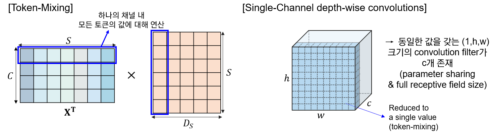
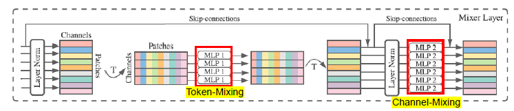
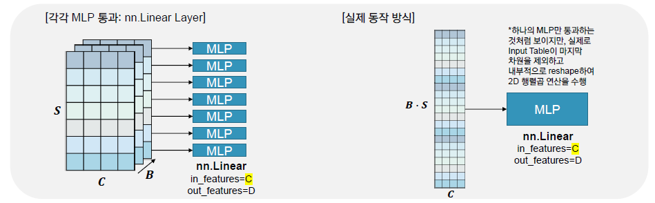
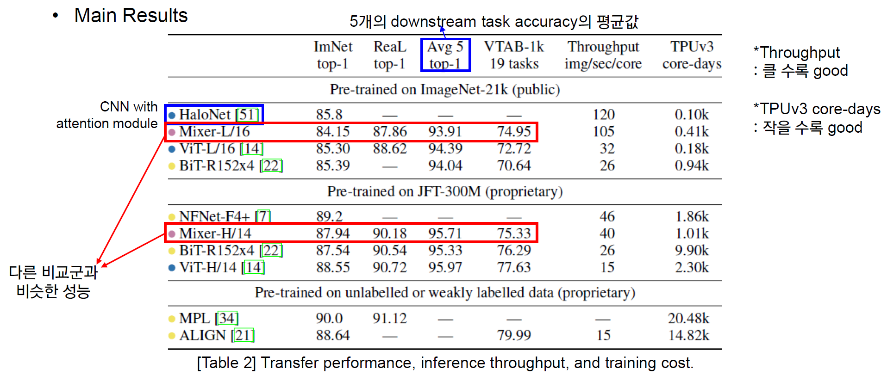
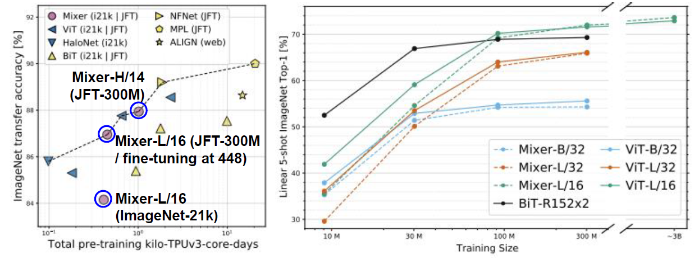
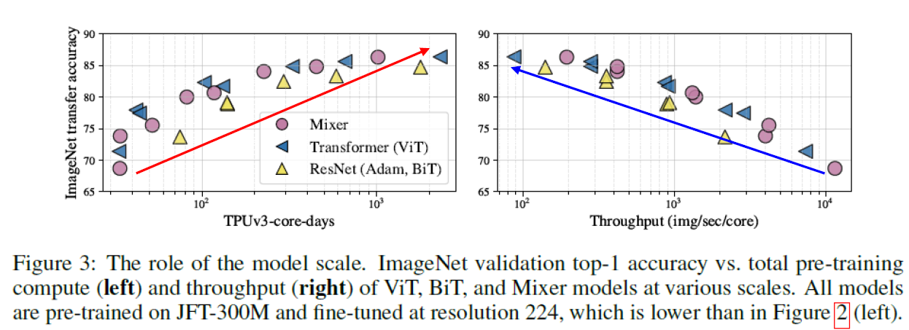
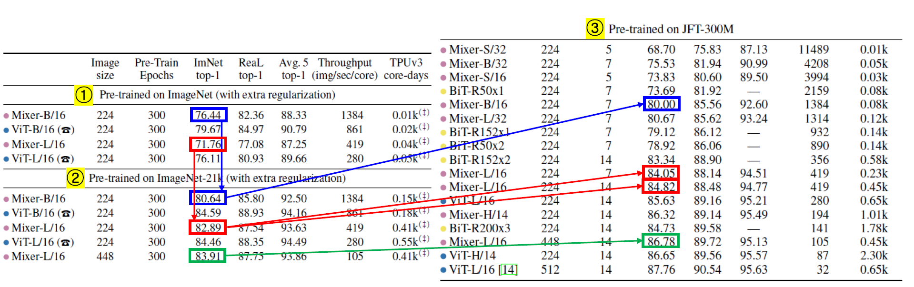
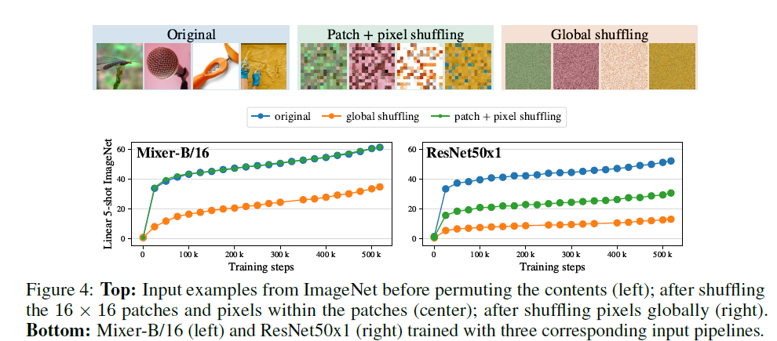
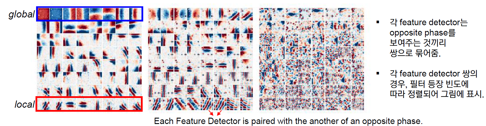
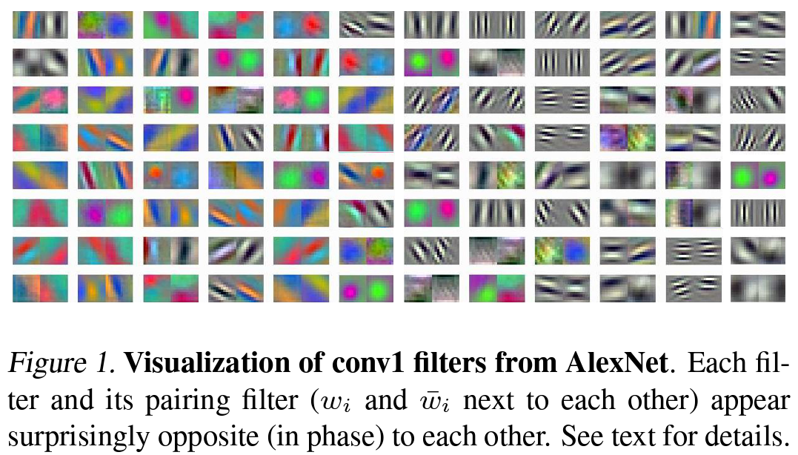

# MLP-Mixer: An all-MLP Architecture for Vision

---

convolution과 attention 기반의 네트워크가 computer vision 분야에서 널리 사용되고 있지만, 실상 이 두가지가 꼭 필요한 것은 아님.

이에 아키텍처 전체가 MLP만을 사용한 MLP-Mixer 구조를 제안함. MLP-Mixer와 같은 경우에는 두 가지 유형의 레이어가 존재함.

- MLPs applied independently to image patches ("mixing" the per-location features)
- MLPs applied across patches ("mixing" spatial information)

큰 데이터셋에서 학습을 시키거나 혹은 최근 제안된 규제(regularization) 방법들을 통해 MLP-Mixer는 기존 SOTA 모델에 견줄 만한 성능을 낼 수 있었음 (pre-training and inference cost 모두).

## 1. Introduction

- Computer Vision
  - Convolution 기반의 CNNs: 현재 CV task에서 기반이 되는 네트워크 구조
  - ViT 등 self-attention 기반의 모델: 최근 SOTA. Hand-crafted visual features & Inductive Bias를 모델로부터 제거하고 data-driven training (raw data에만 의존해서 학습이 진행)을 수행
  → 두 구조 모두 뛰어난 성능을 보여주고 있으나, 실질적으로 꼭 필요한 것은 아님. 즉, 제거 가능함.

  이에 성능에서 뒤지지 않으면서도 컨셉적으로 그리고 기술적으로 간결(no convolutions or self-attention)한 MLP-Mixer (a.k.a. Mixer) 구조를 제안함.

  Mixer 아키텍처와 같은 경우에는 전적으로 MLP에만 의존하는 구조로, MLP가 반복적으로 spatial locations 혹은 feature channels에 걸쳐 통과하게 됨.

  Mixer와 같은 경우에 간단한 matrix multiplication routines, 데이터 레이아웃 (reshape & transpositions) 변경, 상수 nonlinearlities에만 의존하는 구조임.
  → 즉, 다른 구조 대비 simple하다.

### architecture

Mixer는 per-patch linear embeddings, Mixer layers, a classifier head로 구성되어 있음.

Mixer는 ViT와 유사하게 "패치 개수 X 채널" 크기의 테이블을 입력으로 받는다. 이 테이블은 각 이미지(per-patch)를 선형적으로 사영(linear embedding)시킨 시퀀스로, NLP의 Transformer가 받는 것처럼 토큰이라고 부르기도 함.

Mixer는 (Mixer Layer에서) 두 가지의 MLP 레이어를 활용하는데, 하나는 **channel-mixing MLPs**이고 나머지 하나는 **token-mixing MLPs** 이다.

Channel-mixing MLPs와 같은 경우 하나의 토큰 내 여러 채널 간 communication이 이루어지게 하는 모듈로, 각 토큰에 독립적으로 작용하며 테이블의 개별 행을 입력으로 받게 된다.
Token-mixing MLPs와 같은 경우, 각 다른 공간적 위치(각 토큰) 간 communication이 이루어지게 하는 모듈이다. Token-mixing MLPs는 각 채널에 독립적으로 적용되며 테이블의
개별 열을 입력으로 받게 된다.
이 두 가지 레이어가 서로 번갈아가며 등장하면서, 입력 차원 (token, channel) 두 가지의 상호 작용을 가능하게 함.

극단적으로 생각해보면, MLP Mixer가 channel mixing mlp 같은 경우에는 1x1 convolutions를 사용하고, token mixing mlp 같은 경우에는 single-channel depth-wise convolutions를 사용하는 special한 cnn으로 볼 수 있다.

channel mixing의 경우 1x1 convolution을 사용하는 CNN과 동일하다.

공간적 위치는 고정되어 있으면서, 채널 간의 연산만 이루어지고(채널 축 내에서만 연산) 결국 resolution은 유지한 채 (channel-mixing의 경우 시퀀스 길이 S, 1x1 convolution의 경우 feature map의 H,W) 채널 크기만 변경되는 방식으로 아웃풋이 산출이 된다.

Token-mixing mlp의 경우에는 하나의 필터를 공유하는(parameter sharing) full receptive field의 single channel depth-wise convolution이라고 할 수 있다.

token mixing mlp의 경우에는 각 토큰의 특정 채널 값 간 연산이 이루어지기 때문에, 하나의 채널 내 모든 토큰의 값에 대해 연산이 이루어진다고 볼 수 있다.
Single-Channel Depth-wise Convolutions의 경우에는 각 채널 별로 독립적으로 convolution이 적용된다. token mixing의 경우에는 모든 토큰 (전체 이미지 패치)의 한 채널 값에 대해서 연산이 이루어지기 때문에 full receptive field의 single-channel depth-wise convolutions라고 할 수 있다. 이때 token mixing mlp에서는 input의 각 row, 즉 각 채널 차원에 대해서 동일한 가중치를 공유하기 때문에 depth-wise convolution에서  모든 채널에 적용되는 convolution kernel이 동일한 경우와 같다.

따라서, token mixing mlp는 receptive field size가 입력 이미지(혹은 feature map) 크기와 동일한 single channel depth-wise convolutions로 대응될 수 있다.

반면, 통상적인 CNN이 Mixer의 특별 케이스라고 볼 수는 없다. 더 나아가서 Convolution은 MLPs에서 이루어지는 단순 행렬곱 연산보다 더 복잡하다. Convolution은 행렬곱 연산에 추가적으로 reduce하는 과정이 필요할 뿐만 아니라 필요 시에는 추가적으로 맞춰서 구현을 해줘야 하는 부분이 생기기 때문에 CNN이 Mixer보다 복잡한 네트워크라고 할 수 있다.

Mixer는 간결한 구조를 가졌음에도 불구하고, 기존 네트워크에 견줄 만한 성능을 보여준다. 대략 1억 장 정도로 큰 사이즈의 데이터셋에서 사전학습 시켰을 때, (정확도와 비용 간의 trade-off 측면에서) SOTA 성능에 가까운 성능을 보여줬다. 100만 장에서 1000만 장 정도의 중간 사이즈의 데이터셋에서 학습을 시킬 경우에는 modern regularization 기술과 같이 사용했을 때 역시 강력한 성능을 보여주었다. 그러나 ViT와 마찬가지로 중간 사이즈의 데이터셋에서 사전 학습을 했을 시에는 Mixer 역시, 잘 만들어진 CNN 아키텍처보다는 아주 살짝 부족한 성능을 보여주었다.

## 2. Mixer Architecture

modern deep vision architectures consist of layers that mix features

1) at a given spatial location (채널 축 기준 특징 mix)
2) between different spatial locations
3) both at once

CNN의 경우에는, NxN (N > 1) convolutions과 pooling을 통해서 다른 spatial locations 간의 특징을 섞고 (2를 수행) 1x1 convolutions를 통해서 주어진 공간적 위치 안에서 특징을 섞는다 (1을 수행). 이외에 1보다 크기가 더 큰 커널을 이용한 convolution은 1)과 2)를 동시에 수행한다 (채널 차원도 변경되고 spatial resolution도 변경).

ViT를 비롯한 attention 기반의 구조에서는 self-attention 레이어가 1)과 2)를 동시에 수행하고, MLP blocks가 1)을 수행하게 된다.

Mixer의 경우에는 위의 1)과 2)를 각 모듈 별로 분리하여 수행하게 된다. 예컨대 Per-location feature mixing의 경우에는 channel-mixing mlp에서, cross-location feature mixing의 경우에는 token-mixing mlp에서 수행하게 된다.

통상적으로 MLP는 채널 차원만 조작이 가능한 방식으로 사용되어 왔다. 즉, 1)만 수행을 하였던 것. 그러나 MLP Mixer에서는 입력 토큰을 transpose해서 넣어줌으로써 spatial location 간의 communication도 가능케 함.

### Forward (Input)

- 겹치지 않는 이미지 패치로 이루어진 시퀀스 S ($S = \frac{HW}{P^2}$)
- 각 이미지 패치는 사전에 설정한 hidden dimension C로 projection.
- 모든 패치는 동일한 projection matrix를 이용해서 linearly projected.
- Input Table X는 $\mathbb{R}^{S \times C}$ 의 행렬.

### Forward (Mixer Layers)

- Mixer는 전체적으로 동일한 사이즈의 여러 레이어로 구성되어 있음.
- 각 레이어는 2개의 MLP Block을 포함.
- 첫번째 MLP Block은 Token-Mixing, 두번째 MLP Block은 Channel-Mixing.

### Forward (Token-Mixing)

- 입력 테이블 X의 열, 즉 X의 전치행렬의 행에 적용이 된다.
- 2개의 mlp를 통과하면서 $\mathbb{R}^s \rightarrow \mathbb{R}^{D_s} \rightarrow \mathbb{R}^s$ 의 차원 변경을 거치게 됨.
- X의 모든 columns에서 가중치가 공유되는 구조
- $\sigma$: element-wise nonlinearity (applied independtly to each row)

### Forward (Channel-mixing)

- 입력 테이블 X의 행에 적용이 된다.
- 2개의 mlp를 통과하면서 $\mathbb{R}^c\rightarrow \mathbb{R}^{D_c} \rightarrow \mathbb{R}^c$의 차원 변경을 수행하게 됨.
- 가중치가 X의 모든 행에서 공유되는 구조.

### 복잡도 분석

- $D_s$: 입력 패치 개수(S)와는 무관하게 설정
- 따라서, 네트워크의 계산 복잡도는 입력 패치 개수 S($=\frac{HW}{P^2}$)에 linear.
  - ViT의 경우에는 quadratic.
- $D_c$의 경우에는 패치 사이즈(P)와 무관하므로 S에서 P는 상수 취급이 가능함. 따라서 전체 복잡도는 이미지 내 픽셀 개수(HW)에 linear.
  - 이는 통상적인 CNN과 동일한 결과.

### Parameter Tying

- MLP 가중치를 입력 테이블 전체가 공유하는 것
- Channel-mixing MLPs의 경우 Parameter Tying을 통해 Convolutions와 동일하게 Positional Invariant한 특성을 갖게 됨.
- Token-mixing MLPs의 경우는 Depth-wise Convolutions에서 채널 별로 동일한 필터를 갖는 것과 같음.
- Hidden dimension C 혹은 sequence length S를 증가시킴에 따라 네트워크의 파라미터 수가 과도하게 증가하는 것을 방지하고 메모리를 절약하는 효과가 있음.
- Parameter Tying을 사용하지 않는다고 해서 성능의 개선이 이루어진 것은 아니기에 보다 효율적인 Parameter Tying 전략을 사용.

### Isotropic Design of Mixer

- Transformer 등과 같이 네트워크 깊이에 따른 방향에 상관 없이 동일한 아키텍처 디자인을 갖게 됨. (각 레이어 입력이 항상 $S\times C$로 고정)
  - 레고 블럭처럼 모델을 확장시키는 것에 보다 유리한 구조임. (모델 확장성 good)
- Convolution 같은 경우에는 통상적으로 피라미드 구조를 갖게 됨.
  - 이후 계층은 더 작은 해상도의 입력값을 받되, 채널 축으로 깊어지는 등의 구조.

### Other Architectural Components

- Skip-connections
- Layer Normalization
- No Position Embeddings
  - Token-mixing MLPs are sensitive to the order of the input tokens (position-awareness)
  - Classification ehad with the Global Average Pooling Layer followed by a linear classifier

## 3. Experiments

실험을 통해 Mixer가 간단하면서도 SOTA 모델과 견줄 만한 성능을 보여준다는 부분을 보여주고자 함. 특히, 정확도와 training cost 간의 trade-off 측면에서 Mixer의 우수함을 입증하고자 함.

### 사전학습

사전학습은 ImageNet-1k, ImageNet-21k, JFT-300M에 대해 수행하고, 224의 이미지 해상도에서 사전학습을 수행함. Adam의 경우에는 $\beta_1$ $\beta_2$를 각각 0.9와 0.999로 설정함. 10000 스텝 동안 linear learning rate warm-up을 적용하고 이후 linear decay를 적용함. 배치 사이즈는 4096으로 설정하여 학습하였고 weight decay와 gradient clipping (global norm 1)으로 설정함.

ImageNet-21k와 같은 경우에는 extra regularization을 적용했는데, RandAugmentation/mixup/dropout/stochastic depth와 같은 방법론들을 적용.

### Fine-tuning

배치 사이즈는 512로 적용하여 momentum SGD optimizer를 활용하여 fine-tuning을 수행함. 역시 gradient clipping을 수행하였고, 앞서 사용한 learning rate scheduling 전략에서 linear decay 대신 cosine learning rate schedule을 적용했다는 점.

Weight Decay는 이미 사전학습 시 적용하였으므로, fine-tuning 시에는 skip하게 됨. 중요한 점은 패치 크기를 고정하기 때문에 S의 값이 바뀌게 되고, 이에 따라 token mixing MLP의 가중치 shape을 조정해야 함.

Mixer에서는 interpolation 등의 기법을 사용하지 않고, block diagonal을 통해 weight을 재사용하는 방법을 사용함. 이를 위해서는 fine-tuning 시 resolution이 사전학습 시 resolution의 상수배($H'=kH$ & $W'=kW$)임을 가정해야 하고, 이에 따라 $S' = k^2S$로 결정됨. token mixing mlp의 hidden width인 $D_s'$ 역시 pre-train 시의 hidden width인 $D_s$에 비례하게 증가해야 함. 따라서, $D_s' = kD_s$가 됨.

자세한 예시는 아래의 그림을 참고하자.

$H=W=12$, $k=2$라고 할 때, $H'=W'=24$이다. 이때 p=4라고 하면, 다음과 같이 fine tuning 시 이미지 $I'$의 경우 총 36개의 패치가 만들어진다. 이를 바로 flatten시켜서 시퀀스로 만들어주는 것이 아니라 $I'$를 크게 $k\times k$로 쪼개주면, 총 $k^2$개의 sub-image가 만들어지고 각 sub-image는 9개의 이미지 패치로 구성된다. 패치 별로 우선적으로 sequence를 만들어주면 X와 같은 input sequence($c=5$)가 만들어진다. 이에 대한 token mixing mlp의 weight $W'$의 경우, $S'\times D_{s'}$의 matrix이다. 이때 $W'$의 block diagonal (각 block diagonal의 크기는 $9 \times D_s$ 이다)에 기존의 weight matrix인 $W$을 채움으로써 Fine-tuning 시 weight matrix의 조정이 이루어지게 된다.

### Main Results

전반적으로 ViT와 유사한 양상을 보인다.

1. 사전학습 데이터셋 크기가 커질 수록 더 좋은 성능을 보여주었다.
2. Regularization을 강하게 걸어주지 않으면 overfitting에 취약한 양상을 보여주었다.
3. 정확도와 학습 비용 간의 trade-off 면에서 타 모델 대비 우수한 결과를 보여주었다.

위의 Table2를 보았을 때, Mixer가 타 모델과 비슷한 성능을 내면서도 Throughput과 학습 소요 시간에서 대체적으로 더 높은 효율을 보여줌을 알 수 있다.

(좌측) Table2를 바탕으로 파레토 전선을 그려보았을 때, Mixer의 경우 파레토 전선에 위치하며 그 효율성을 보여주었다. 또한, 타 모델과 비슷한 성능을 보여줌을 역시 확인할 수 있다.

(우측) Mixer가 사전학습 데이터셋 크기가 작을 경우 더 낮은 성능을 보여주었으나, 크기가 커질 수록 타 모델 대비 성능 증가 폭이 매우 큼을 알 수 있다. 또한, 데이터셋 크기가 3억장~30억장이 될 경우에는 기존 SOTA인 ViT에 필적하는 정확도를 보여주었다.

### The role of the model scale

모델 규모가 커질 수록 (core-days가 높을 수록, throughput이 낮아질 수록 모델 규모는 커지게 됨) 성능은 증가함.

### The role of the pre-training dataset size

모델 규모와 유사하게, 데이터셋 크기가 증가(1→2→3)할 수록 성능도 증가하는 추세.

### Invariance to input permutations

아래 실험을 통해 Mixer가 CNN보다 더 적은 inductive bias를 갖고 있음을 보여주고 있음.

JFT-300M에서 학습시킨 Mixer-B/16과 ResNet50x 1 모델을 비교함. 학습 시 입력 transformations에 다음과 같은 2개의 variations를 줌.

1. 패치 순서를 shuffling + 패치 내에서 pixel permutation
2. 전체 이미지에서 픽셀을 globa하게 permute

이때, shuffling과 pixel permutation은 모든 이미지에 동일하게 적용되며 패치 내 pixel permutation 또한 각 패치마다 동일한 permutation이 적용됨.

Mixer의 경우, 패치의 순서와 패치 내 픽셀 순서에 불변(robust)함. 단, global하게 shuffling을 할 경우에는 성능 감소가 있긴 하지만, ResNet의 성능 감소보다는 훨씬 적었음. Mixer의 경우, **이미지 내 패치 순서에 대한 가정을 하지 않고** 데이터 기반으로만 학습하고 있음을 보여줌.

ResNet 같은 경우에는 shuffling을 적용하면 성능에 심각한 악영향을 미침. ResNet의 강력한 inductive bias가 이미지 픽셀의 특정 순서에 의존하고 있음을 추측할 수 있다.

### Visualization

CNNs의 경우에는 이미지 local regions에 주목하는 feature detector를 학습하는 경향이 있는 반면, Mixer는 token-mixing MLPs에서 global information exchange가 발생한다.

Mixer-B/16 모델의 첫 3개 Token Mixing MLPs를 시각화한 결과, Mixer의 경우에는 이미지 전체(global)에 작용하는 특징을 학습하면서도, 동시에 좀 더 작은 영역(local)에서 작용하는 특징을 학습함을 알 수 있었다. ViT와 유사하게 global과 local 정보를 동시에 추출하는 경향이 존재한다고 할 수 있다.

CNN을 시각화해볼 때, 반대 양상을 보여주는 feature detector 쌍이 다수 발견되는데, 이러한 부분이 Mixer에서도 다수 발견되었다.

## 4. Related Work

- CNNs
  - VGGNet(2014): small kernel size of 3 with deeper networks
  - ResNet(2015): Skip Connections with Batch Normalization
  - Wu et al. (2019): share parameters in the depth-wise convolutions
  - The concept of 1x1 convolutions applied to Channel Mixing MLPs
  - Normalization Methods also applied to the Mixer

- Self-Attention Based Transformers
  - ViT (2021): fewer locality bias but scales well to large data (and is robust as well)
  - Touvron et al. (2021) : Smaller dataset 학습을 위한 regularization methods 적용
  - Mixer Borrows Design Choices from
    - Transformer (2017) : MLP Mixer’s design
    - ViT (2021): Input Sequence Design

- Fully Connected Networks
  - Lin et al. (2016): 오토인코더를 이용한 사전 학습, 높은 강도의 data augmentation을 통해 FC Nets를 CIFAR-10 dataset에 성공적으로 적용.
  - Neyshabur (2020): Custom Regularization과 optimization 방법을 고안하여 fully-connected networks를 small scale task에 성공적으로 적용.

Mixer의 경우에는 일반적인 regularization, optimization을 사용하면서도 큰 크기의 데이터셋에 성공적으로 적용해냈다는 점에서 앞선 fully connected networks 선행 연구보다 의의가 크다고 할 수 있음.

- Random Init + 간단한 전처리가 기존에는 주를 이루었으나, 현재는 Large Scale Dataset에서 사전학습된 가중치 기반 fine-tuning 혹은 강력한 Augmentation (mixup, RandAug 등)을 기반으로 모델을 학습하는 게 주요 트렌드가 되었음. 이를 Mixer의 실험에도 동일하게 적용함.

## 5. Conclusions

### Contributions

매우 간단한 구조
동시에 정확도와 연산 비용 간의 trade-off 측면에서 기존 SOTA 만큼 높은 성능을 보여주었음.

### Further Research

추후 학습된 feature들을 추출하여 기존 CNN과 Transformer와 어떤 차이가 있는지 비교하는 등의 후속 연구가 진행될 수 있을 것임.
네트워크의 Inductive Bias를 보다 연구하여 generalization에 어떤 영향을 미치는지 연구가 진행될 수 있을 것.
