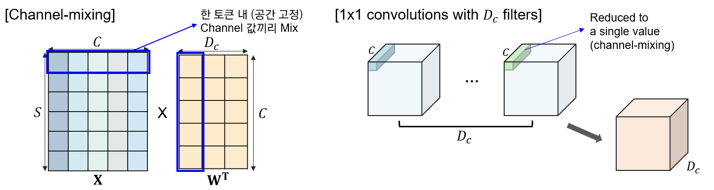

# MLP-Mixer: An all-MLP Architecture for Vision
---

convolution과 attention 기반의 네트워크가 computer vision 분야에서 널리 사용되고 있지만, 실상 이 두가지가 꼭 필요한 것은 아님.

이에 아키텍처 전체가 MLP만을 사용한 MLP-Mixer 구조를 제안함. MLP-Mixer와 같은 경우에는 두 가지 유형의 레이어가 존재함.

- MLPs applied independently to image patches ("mixing" the per-location features)
- NLPs applied across patches ("mixing" spatial information)

큰 데이터셋에서 학습을 시키거나 혹은 최근 제안된 규제(regularization) 방법들을 통해 MLP-Mixer는 기존 SOTA 모델에 견줄 만한 성능을 낼 수 있었음 (pre-training and inference cost 모두).

## 1. Introduction
- Computer Vision
  - Convolution 기반의 CNNs: 현재 CV task에서 기반이 되는 네트워크 구조
  - ViT 등 self-attention 기반의 모델: 최근 SOTA. Hand-crafted visual features & Inductive Bias를 모델로부터 제거하고 data-driven training (raw data에만 의존해서 학습이 진행)을 수행
  → 두 구조 모두 뛰어난 성능을 보여주고 있으나, 실질적으로 꼭 필요한 것은 아님. 즉, 제거 가능함.

  이에 성능에서 뒤지지 않으면서도 컨셉적으로 그리고 기술적으로 간결(no convolutions or self-attention)한 MLP-Mixer (a.k.a. Mixer) 구조를 제안함. 

  Mixer 아키텍처와 같은 경우에는 전적으로 MLP에만 의존하는 구조로, MLP가 반복적으로 spatial locations 혹은 feature channels에 걸쳐 통과하게 됨.

  Mixer와 같은 경우에 간단한 matrix multiplication routines, 데이터 레이아웃 (reshape & transpositions) 변경, 상수 nonlinearlities에만 의존하는 구조임.
  → 즉, 다른 구조 대비 simple하다.

### architecture

Mixer는 per-patch linear embeddings, Mixer layers, a classifier head로 구성되어 있음.

Mixer는 ViT와 유사하게 "패치 개수 X 채널" 크기의 테이블을 입력으로 받는다. 이 테이블은 각 이미지(per-patch)를 선형적으로 사영(linear embedding)시킨 시퀀스로, NLP의 Transformer가 받는 것처럼 토큰이라고 부르기도 함.

Mixer는 (Mixer Layer에서) 두 가지의 MLP 레이어를 활용하는데, 하나는 **channel-mixing MLPs**이고 나머지 하나는 **token-mixing MLPs** 이다.

Channel-mixing MLPs와 같은 경우 하나의 토큰 내 여러 채널 간 communication이 이루어지게 하는 모듈로, 각 토큰에 독립적으로 작용하며 테이블의 개별 행을 입력으로 받게 된다.
Token-mixing MLPs와 같은 경우, 각 다른 공간적 위치(각 토큰) 간 communication이 이루어지게 하는 모듈이다. Token-mixing MLPs는 각 채널에 독립적으로 적용되며 테이블의 
개별 열을 입력으로 받게 된다.
이 두 가지 레이어가 서로 번갈아가며 등장하면서, 입력 차원 (token, channel) 두 가지의 상호 작용을 가능하게 함.

아주 극단적인 경우, Mixer는 CNN의 특별한 케이스라고 할 수 있다. channel mixing의 경우 1x1 convolution을 사용하는 CNN과 동일하다.

token mixing mlp의 경우에는 하나의 필터를 공유하는(parameter sharing) full receptive field의 single channel depth-wise convolution이라고 할 수 있다.
