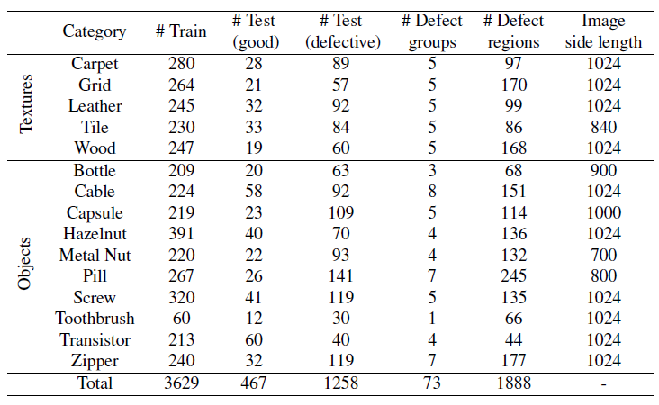

# MVTec AD - A Comprehensive Real-World Dataset for Unsupervised Anomaly Detection

the first comprehensive, multi-object, multi-detect dataset for anomaly detection that provides pixel-accurate ground truth regions and focuses on real-world applications

---

## 1. Introduction

- recently a significant amout of interest has been directed towards novelty detection in natural image data
- 많은 알고리즘이 새로운 input이 기존 학습 데이터의 distribution과 매칭되는지 탐지하는 방식을 취하고 있음.
  - inlier and outlier distribution이 심각하게 다른지 판별하는 classification setting에 집중하는 방식
→ outlier detection or one-class classification
- 분류 모델 중 SOTA 모델이 anomaly detection tasks에 얼마나 잘 작용할지는 모름.
- anomaly detection problem setting: training data와 매우 비슷하게 생겼지만 아주 작은 영역에서 아주 작은 차이가 존재하는 novelty를 찾는 경우 → 매우 어렵다, 이러한 problem setting에 적합한 데이터가 필요하다.
- 지금까지 unsupervised anomaly detection에 적합한 데이터셋이 없었음.
- 이에 MVTec Anomaly Detection Dataset을 소개함.

### Contribution of MVTec Anomaly Detection Dataset
1. a novel and comprehensive dataset for the task of unsupervised anomaly detection in natural image data
   - consists of 5354 high-resolution images of five unique textures and ten unique objects from different domains.
   - 73 different types of anomalies in the form of defects in the objects or textures.
   - provides pixel-accurate gound truth regions (1888 in total)

2. 제안하는 데이터셋 기반으로 현재 SOTA 모델 + 기존의 unsupervised anomaly detection 방법론에 대한 thorough evaluation 진행
   - 또한 비정상 이미지에 대한 사전지식 없이 하이퍼파라미터를 이용해서 이상 영역을 탐지하는 방법 역시 제안.

  

## 2. Related Works
### 2.1. Existing Datasets for Anomaly Detection
#### 2.1.1. Classification of Anomalous Images
- 기존의 classification task의 데이터셋을 많이 활용함. 클래스 중 일부만 임의로 골라 outlier로 re-label함. 이후, 남은 inlier class에만 novelty detection system을 학습시킴. test 단계에서는 학습된 모델이 테스트 샘플이 inlier class에 속하는지 아닌지를 정확히 예측해내는지를 평가함.
- 하지만 이 경우에는 많은 양의 데이터가 존재한다는 장점은 있지만, 비정상 샘플이 training distribution에서 뽑힌 샘플과 굉장히 다름. 따라서 training data manifold에서 차이가 많이 나지 않는 경우의 anomaly는 제대로 다룰 수 있을지 여부가 불투명함.

→ 기존의 분류 데이터셋에 기대어 anomaly detection을 수행하는 것은 training data manifold(inlier distribution)와 outlier distribution이 **매우 다른** 분포를 가질 때만 다루기 때문에, 그렇지 않고 subtle anomaly의 경우는 다루지 못하고 있음.

- 이에 Saleh et al.은 6개 카테고리의 **비정상적인 모양의 물체**들을 포함하는 데이터셋을 제안함. (PASCAL VOC 데이터셋과 같은 카테고리. PASCAL VOC가 정상 데이터가 되는 셈)
  - 이 데이터셋은 비정상 데이터가 training data manifold와 보다 비슷하긴 하지만, 여전히 비정상 혹은 novelty에 대한 판단이 이미지의 부분이 아니라 전체 이미지에 의존한다는 점(image level classification)은 해결하지 못했음.

***→ 여기서 얻을 수 있는 intuition은 어쨌든 이 데이터는 실제로 전체 이미지보다도 이미지의 부분에 존재하는 anomaly를 담아내려고 만든 데이터셋이라는 점. 따라서 이미지 패치를 어떻게 구성하는가에 따라서 모형 성능이 좀 달라질 수 있겠단 생각이 들었음.***

#### 2.1.2. Segmentation of Anomalous Regions
- segment anomalies에 대한 데이터셋은 texture 위주의 비정상 탐지에 집중할 뿐 아니라 natural images에 대한 데이터셋은 존재하지 X

 

### 2.2. Methods
#### 2.2.1. Generative Adversarial Networks
- Schlegl. et al.: defect-free 이미지에만 학습된 GAN을 통해서 training data의 manifold를 모델링하는 방식을 제안함. Anomaly Detection의 경우, 주어진 입력 이미지를 복원하는 latent sample을 찾고, D를 속일 수 있도록 함.

#### 2.2.2. Deep Convolutional Autoencoders
- Convolutional AutoEncoders (CAEs): reconstruct defect-free training samples through a bottleneck (latent space).
  - 테스트 단계에서 학습 단계에서 관찰된 데이터와 다른 이미지를 복원하는 데에 실패하는 방식으로 테스팅이 이루어짐. (비정상인 경우엔 복원을 못한다)
  - "복원을 못한다"는 어떻게 판단하느냐? 복원된 이미지와 입력 이미지 간의 **per-pixel comparison(픽셀 별 비교)**로 이루어짐.
- Various extensions to CAEs such as VAEs (하지만 deterministic autoencoder frameworks가 더 잘 작동하였음. VAEs 혹은 다른 deep generative model 같은 경우 학습 데이터의 true likelihood를 모델링하는 데에 실패할 수 있기 때문.

#### 2.2.3. Features of Pre-trained Convolutional Neural Networks
- 별도의 image classification task에서 사전학습된 CNN으로부터 얻은 feature descriptor를 사용 (앞서 언급된 방법론은 training data에서만 feature representation을 학습하는 것)
- Napoletano et al.: use clustered feature descriptions obtained from the activations of a ResNet-18 classification network pre-trained on ImageNet to distinguish normal from anomalous data. 이 경우에는 anomaly or not의 binary classification으로만 줄 수 있기 때문에 anomalous segment를 찾아내려면 per-pixel classification이 필요해짐. 이 경우엔 performance bottleneck이 될 것.

  

## 3. Dataset Description

- 15 categories with 3629 iamges for training and validation and 1725 images for testing.
- **학습 이미지 같은 경우에는 정상 이미지만 포함**하고, test set 같은 경우에는 정상과 비정상이 모두 포함되어 있음.
- Five categories cover different types of regular (carpet, grid) or random (leather, tile, wood) textures, while the remaining ten categories represent various types of objects
- Some of these objects are rigid with a **fixed appearance** (bottle, metal nut), while others are **deformable** (cable) or include **natural variations** (hazelnut).
- A subset of objects was acquired in a **roughly aligned pose** (e.g., toothbrush, capsule, and pill) while others were placed in front of the camera **with a random rotation** (e.g., metal nut, screw, and hazelnut).
  
- The test images of anomalous samples contain a variety of defects, such as defects on the objects' surface, structural defects like distorted object parts, or defects that manifest themselves by the absence of certain object parts.
- 모든 이미지는 2048X2048 크기의 high-resolution industrial RGB sensor에 의해 수집됨. + magnification factors of 1:5 and 1:1, respectively.
- the images were cropped to a suitable output size. All image resolutions are in the range between 700 X 700 and 1024 X 1024 pixels.
- 3 object categories (grid, screw, and zipper) are made available soley as single-channel images.
- illumination condition을 strict하게 조절해서 이미지를 얻었으나, 몇개의 object 클래스에서는 variability를 높이기 위해서 의도적으로 illumination을 조정한 경우도 있음.

  

## 4. Benchmark
여러 SOTA 모델을 대상으로 학습 후 평가를 진행. 결과적으로, 전체 데이터셋 대상으로 가장 뛰어난 방법론은 없었음.
전반적으로 Texture와 Object를 따로 학습을 진행한 것처럼 보임.

### 4.1. Evaluated Methods
#### 4.1.1. AnoGAN
- GAN의 latent space dimension은 64로 고정, 생성된 이미지는 128X128로 고정
- Dataset 내 모든 카테고리에 대해서 어느 정도 안정적인 training 결과를 보여줌.
- Trained for 50 epochs with an initial learning rate of 0.0002.
- During testing, 300 iterations of latent space search are performed with an initial learning rate of 0.02
- Anomaly maps are obtained by a per-pixel $l^2$-comparison of the input image with the generated output (각 픽셀별 차이 제곱합으로 anomaly maps를 만들었다)
- texture와 object 두 가지로 나눠서 data preprocessing을 진행한 듯. 
  - **object**: 128 픽셀 크기로 input을 zoom. (zoom했다는 거 보니까 단순 resize는 아닌 것 같단 생각)
  - **texture**: 데이터셋 이미지를 모두 512 X 512로 zoom해주고, 이후에 training patch 128짜리로 extract해줌.
- Data augmentation은 후술될 4.2.절에서 설명한 대로 적용.
- Testing 과정의 경우, patchwise evaluation 수행 (128 pixel의 horizontal and vertical stride 적용 → smaller stride infeasible due to the AnoGAN's long runtimes)

#### 4.1.2. L2 and SSIM AutoEncoder
- same CAE architecture as described by Bergmann et al.
- reconstruct **texture** patches of size 128 X 128.
  - employing either a per-pixel $l^2$ loss or loss based on the structural similarity index (SSIM)
- SSIM loss와 같은 경우엔 SSIM 윈도우 사이즈를 11로 설정해줬을 때 잘 적용되었음.
- latent space dimension은 100으로 설정해줌.
- **Object**
  - 이미지 사이즈를 128로 설정했을 때는 데이터셋 내의 전체 objects를 복원하기엔 너무 작았음.
  - 따라서, 이 경우에는 texture에 사용된 아키텍처에 convolution layer를 몇 개 더 붙여서 구조를 확장시킨. 이 경우 256 resolution의 object image를 process하는 게 가능.

- Objects와 같은 경우, anomaly map은 다음과 같이 만들어진다.
  - 입력 이미지를 autoencoder에 통과시켜서 얻은 reconstruction에 