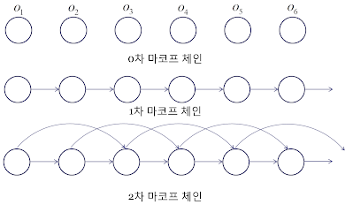
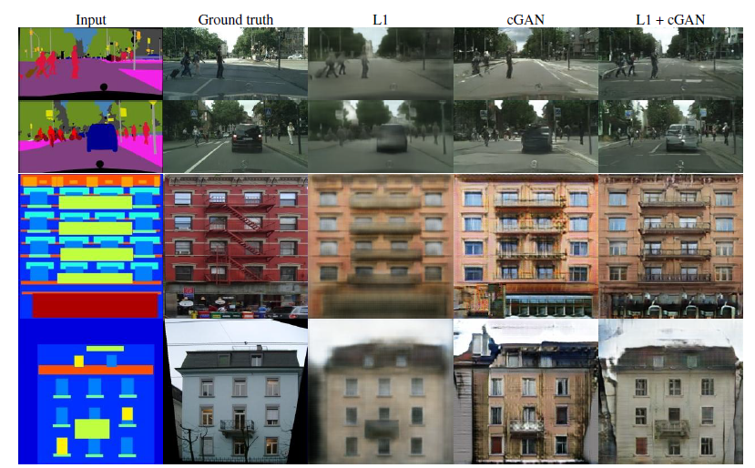
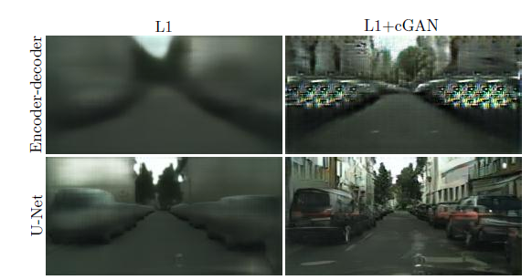
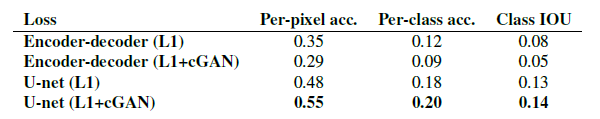
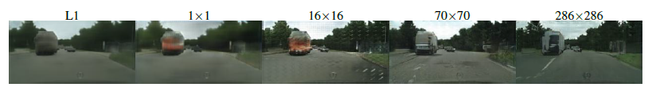
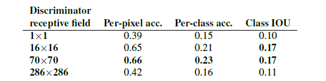
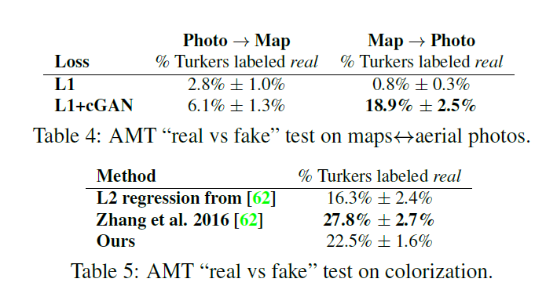
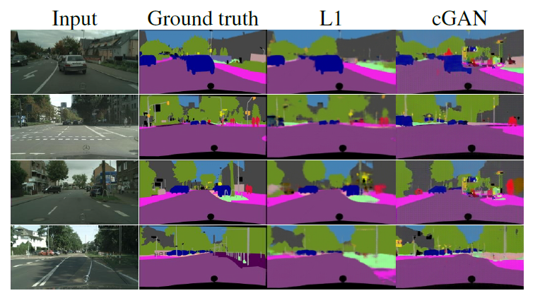
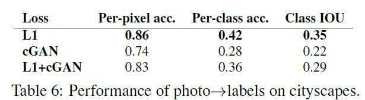
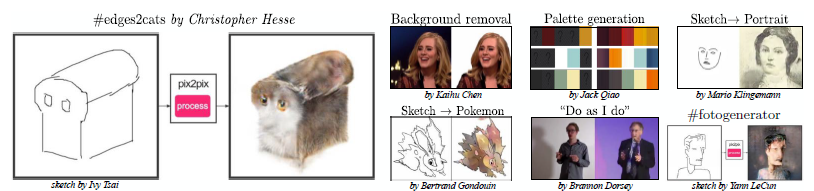

# Image-to-Image Translation with Conditional Adversarial Networks

networks not only learn the mapping from input image to output image, but also learn a loss function to train this mapping

---
## 1. Introduction
- Image Translation: the task of translating one possible representation of a scene into another, given sufficient training data.

    e.g.) Labels to Street Scene, Labels to Facade, BW to Color, Aerial to Map, Day to Night, Edges to Photo 등

- 이전까지는 위의 예시로 든 태스크들이 하나의 일반적인 image translation solution 하에서 다뤄진 게 아니라, 각 태스크를 다루는 각각의 모델이 있었음 (one for all 보다는, each to each)
  - 이러한 모델들은 공통적으로는 pixel 단위로 예측을 했다는 점.
- pix2pix 논문에서는 위의 task를 아우르는 하나의 **common framework**을 제안함.
- CNN 기반으로 관련 연구가 다수 이루어졌으나, loss 설계에 있어서 비용이 큼.
  - 또한 기존의 loss는 예측 픽셀값과 실제 픽셀값의 euclidean distance를 최소화하는 것을 기반으로 함.
  - 이렇게 될 경우 결과 이미지가 blurry하게 나오는 현상이 발생.
- 결과가 **sharp하고 실제와 같은 이미지처럼 나오게** 하는 건 아직 해결 못한 문제였고, 전문 지식을 일반적으로 많이 요구함.
 

- sharp & realistic image를 보다 쉽게 얻어내는 건 GAN을 통해 이루어질 수 있음 (general & simple)
  - GAN은 data-adaptive하기 때문에 보다 다양한 task에 쓰일 수 있다는 점. 
  - 실제 이미지와 가짜 이미지를 잘 구분하자는 objective 하에서 학습이 진행이 되기 때문에 보다 simple하면서도 high-quality image를 얻어낼 수 있음.
- image translation 작업을 그럼 GAN과 어떻게 연결지을 수 있느냐? → **conditional GANs**
  - input image를 condition해서 corresponding output image가 나오는 구조.
  - 기존에 cGANs을 이용한 image translation 연구는 특정 태스크에 집중해서 이루어졌고, 좀 더 범용적인 네트워크 구조는 제안되지 않은 상태.
  - 따라서, pix2pix 논문에서는 cGANs을 이용하여 보다 범용적인 image translation solution을 제안하고자 함.

### Contribution
1. 다양한 문제에 있어 conditional GANs가 합리적인 결과를 만들어낼 수 있음을 밝힘.
2. 간결하면서도 좋은 성능을 보이는 프레임워크를 제안하며, 여러 architectural choice가 전체 성능에 어떤 영향을 주는가에 분석을 수행.

  

## 2. Related Work

### Structured losses for image modeling
- image-to-image translation의 문제를 **픽셀 단위**의 classification 혹은 regression 문제로 다루는 경우
  - output space를 unstructured (즉, 각 output pixel이 conditionally independent하다고 가정하는 것 -> what is conditional independence? 어떤 변수를 condition했을 때, 즉 그 값을 고정시켰을 때 나머지 변수는 각각 독립)
- Conditional GANs의 경우에는 *structured loss*를 학습함. 즉, output의 **joint** configuration에 페널티를 주게 됨.
- 기존의 연구들 중에서도 structured loss 기반으로 학습하는 경우도 많았으나 conditional GANs와 같은 경우에는 loss가 학습이 된다는 점, 이론상으로는 output과 target 간의 구조적 차이(어떤 형태든)를 penalize할 수 있다는 장점이 있음.
 

### Conditional GANs
- cGANs을 이미지 분야에서 적용한 이전의 연구
  - image prediction from a normal map, future frame prediction, product photo generation, and image generation from sparse annotations 등의 sub-task
- non-conditional GANs를 image-to-image mapping에 적용한 연구들도 존재함.

→ BUT 이전 연구와 같은 경우, application에 맞춰서 짜여져있었음.

- pix2pix의 경우에는 하나의 적용분야에만 특정된 프레임워크가 아니고 **보다 넓은 범위에서 적용**함. 따라서 다른 방법론 대비 **매우 간단하다는 장점**이 있음.
- 또한, "U-Net" 기반의 generator, "PatchGAN" classifier 형태의 discriminator를 사용함으로써 이전 연구와의 차별점을 둠.
  - PatchGAN Classifier: penalizes structure at the scale of image patches (이전에도 비슷한 연구가 이루어졌으나, 본 연구에서는 좀 더 다양한 문제를 해결하는 데에 있어 효과적이라는 점에서 의의가 있다)
  

## 3. Method

- recap of GANs
  - random noise vector $z$로부터 출력 이미지 $y$로의 mapping $G: x→y$을 학습하는 생성 모델
  - GANs conditioned on $x$ : 샘플 이미지 $x$와 random noise vector $z$로부터 출력 이미지 $y$로의 mapping $G: \{x,z\} → y$ 를 학습.
 

### 3.1. Objective
- D also conditioned on X
$$\mathcal{L}_{cGAN}(G,D) = \mathbb{E}_{x,y}[logD(x,y)] + \mathbb{E}_{x,y}[1-logD(x,G(x,z))]$$

- D not conditioned on X (to test the importance of conditioning the discriminator)
$$\mathcal{L}_{GAN}(G,D) = \mathbb{E}_y[log D(y)] + \mathbb{E}_{x,z}[log(1-D(G(x,z)))]$$

  - discriminator를 X에 대해 condition시킬 것인지의 여부에 대한 ablation study도 추후 수행

- Adversarial Loss + L1 Loss
  - L2 distance 등 기존에 사용되던 loss를 Adversarial Loss와 함께 사용하는 것이 도움이 됨. 이 경우에 discriminator에는 영향을 주지 않지만, generator와 같은 경우에는 discriminator를 속이는 것뿐 아니라(GAN objective), **실제 출력값과 비슷한 값을 갖도록(L2 Distance) 강제.**
  - L1 vs. L2: L2보다 L1이 덜 blurry한 출력값을 리턴하기 때문에 L1을 사용한다.

  $$ \mathcal{L}_{L1}(G) = \mathbb{E}_{x,y,z}[\lVert y-G(x,z)\rVert_1]$$

- final Objective
$$G^* = \arg \min_G \max_D \mathcal{L}_{cGAN}(G,D) + \lambda\mathcal{L}_{L1}(G)$$

  - 최종적으로, 위와 같이 목적함수가 구성되며 cGAN Loss에서는 Generator가 실제 label에 가까우면서도 realistic한 이미지를 출력할 수 있도록 하고 Discriminator는 input과 output이 match되는지를 확인함.
  - L1 loss의 경우에는 Generator가 input과 보다 match되는 이미지를 만들어낼 수 있도록 penalize.

- random noise z를 G의 입력으로 넣어줄 것인가?
  - G에서의 random noise z의 역할
    - z는 G의 출력에 **stochasticity**를 줌으로써 다양한 distribution을 matching해낼 수 있도록 함.
    - z가 없을 경우, 네트워크는 x에서 y로의 mapping을 학습하기는 하나 확정적인(deterministic) 출력값을 생성해낼 것. 이는 결국 delta function 이외에 다른 distribution은 match해내지 못함을 의미함.
    - delta function
    
    하나의 점에서는 무한대로 발산하나, 이외의 값에서는 0의 값을 갖게 됨. 좌표계에서 점을 정의하는 데에 사용. 사진에서 보면 알 수 있듯이, $\delta(x-a)$의 경우, a값 이외에서는 값을 갖지 않는다. 이를 분포 측면에서 해석하면 확률변수 X는 오로지 a값만 가지게 되는 확률분포를 따르는 것 (produce deterministic outputs).
  - (Mathieu et al., 2016): generator의 입력으로 input frame X가 들어가기 때문에, **noise가 없어도 variability가 존재**함. 따라서, 굳이 random noise가 필요하지 않음. (in video의 next frame prediction)
  - 위의 연구에서 밝힌 바와 같이 실제 실험을 진행한 결과, z를 같이 학습하는 경우 generator가 단순히 noise를 무시하게 되는 방향으로 학습될 뿐 성능 향상에 효과적이지는 않았음.
  → z를 x와 같이 G의 input으로 넣어주는 전략은 폐기

- Dropout
  - random noise를 명시적으로 G에 입력하지 않고도 output에 noise(=stochasticity)를 주기 위함.
  - training과 test time 모두에 generator의 몇몇 layer에 적용.
- 그러나 generator 출력을 살펴본 결과, dropout을 적용했음에도 불구하고 출력값의 불확정성이 크지는 않았음 (observed only minor stochasticity → relatively low entropy of the approximated conditional distributions)
- *이러한 low stochasticity는 추후 해결해야할 문제.*

 

### 3.2. Network Architectures
Generator와 Discriminator의 경우, DCGANs의 구조를 가져왔으며 generator와 discriminator 모두 'convolution-BatchNorm-ReLU' 형태의 module을 사용하고 있음.

#### 3.2.1. Generator with skips
image-to-image translation task에 대한 고찰을 토대로 skip-connection이 효과적일 것임을 제안.

- 위의 사진에서 보다시피, image-to-image translation task의 경우에는 input과 output이 겉보기엔 다르게 생겼으나 실제 기반에 있는 구조는 동일한 구조임.
  - 따라서, input 이미지 구조와 output 이미지 구조는 엄밀히는 아니지만 대략적으로는 align되어 있는 구조 (roughly aligned)
  - 즉, image-to-image translation task에서는 input과 output은 low-level feature를 어느 정도 공유하고 있음을 짐작할 수 있음. (이미지를 봐도 사물의 형태나 edge 등이 비슷하게 형성이 되어 있음.)
    → skip-connection이 효과적일 것.

- 기존 Generator는 encoder-decoder 구조를 취하는 경우가 많았음. 즉, 점진적으로 downsampling을 거친 후에 bottleneck layer를 거치면서 다시 reverse해서 upsampling을 수행하는 구조임. (contractive → expansive)
- 앞서 말했듯 input과 output은 low-level feature를 상당수 공유하고 있음. encoder-decoder 구조 상 전체적으로 information flow가 흐르는 구조이긴 하지만 low-level의 information을 보다 직접적으로 전달을 해주기 위해서 skip-connection을 활용함. (Encoder-Decoder with skip-connection, that is U-Net)
  

  - layer $i$와 layer $(n-i)$를 연결하는 구조.
 

#### 3.2.2. Markovian discriminator (PatchGAN)
- Generator Loss가 Discriminator의 일을 덜어줌.
  - L1(or L2) loss는 high-frequency는 잘 잡아내지 못하고, blurry한 결과를 산출하게 됨. 반대로 Low-frequency는 정확하게 잡아냄.
    - high-freq: detail & low-freq: 추상적인 형태, 구상에 좀 더 가까움
  - pix2pix에서는 generator loss에 L1 loss term을 추가한 형태. 따라서, discriminator가 low frequency를 잘 잡아내도록 설계할 필요 없이 generator loss만으로도 generator가 학습이 되면서 어느 정도 low frequency는 잘 잡혀서 output이 산출될 것임.
- **PatchGAN**: 이미지 부분적 패치만 고려하는 discriminator
  - 이에 Discriminator 설계는 high-frequency structure, 즉 이미지 내 세부적인 디테일을 잘 잡아낼 수 있는 형태로 수행.
  - 이미지의 전반적인 형태나 구상을 보는 게 아니라, 세부적인 디테일만 모델링을 진행하는 것이므로 **local image patch** 내 구조를 파악하기만 하면 됨 (only penalizes structure at the scale of the patches).
  - *이미지 내 **NXN** 패치*가 real인지 fake인지 구분하는 작업을 수행하게 됨.
    - 이미지 패치 크기 N은 출력 결과의 성능 저하 없이 이미지 사이즈보다 훨씬 작은 값으로 설정 가능함.
    - 즉, N 사이즈를 작게 가져감으로써 PatchGAN은 보다 적은 파라미터를 가지고, 더 빠른 수행 속도를 보여주며, 어떤 사이즈든 비교적 큰 이미지에도 적용이 가능함.
  - 이미지 내에서 convolution을 통해서 discrimination을 수행한 후, 이를 평균내어 최종적인 D의 출력을 산출하는 형태로 동작.
- Why Markovian?
  - k차 마르코프 체인
  
    
    - k차 Markov chain은 t 시점의 데이터가 t-1 ~ t-k번째까지의 데이터와 관련이 있음을 의미함. (나머지와는 independent)
  - k보다 먼 거리의 pixel 간의 독립
    - PatchGAN 구조의 discriminator의 경우에는 패치 직경 k보다 더 떨어져있는 픽셀끼리는 서로 독립이라고 가정함. (effectively models the rimage as a Markov random field)
    - 이러한 가정은 texture나 style을 모델링할 때 많이 사용되는 가정임. 즉, 이러한 측면에서 PatchGAN은 texture나 style loss의 한 형태로 해석될 수 있음.

 

### 3.3. Optimization and Inference
- train
  - alternating training between D and G + G를 학습할 때 가짜를 가짜로 판별할 확률을 줄이는 것이 아니라 가짜를 진짜로 판별할 확률을 높이는 방식으로 학습. 
  → original GAN 논문의 방법을 따름. 
  - D를 학습하면서 objective를 2로 나눔으로써 D의 학습 속도를 G에 맞춰서 느리게 해줌.
  - 미니배치 학습 진행 + Adam optimizer → learning rate of .00002 & momentum parameters $\beta_1=0.5$, $\beta_2=0.999$
- inference
  - dropout을 test time에도 적용
  - batch normalization의 경우, train time에서의 통계량을 이용하는 것이 아니라 test time에서의 통계량을 이용해서 normalization을 수행함.
    - batch size를 1로 가져가는 경우, Instance Normalization으로 칭함. (이미지 생성 작업에 매우 효과적임이 이미 보여진 바 있음)
    - pix2pix에서는 batch size를 1과 10 사이로 조정해가며 실험을 수행함.

  

## 4. Experiments
모델의 범용성을 확인하기 위해 다양한 task와 datasets에 실험해봄. 
e.g.) Cityscapes dataset에서 semantic labels ↔ photos task 실험, CMP Facades dataset에서 Architectural labels→photo task 실험, 
Map ↔ aerial photo, BW → color photos, Edges → photo, Sketch → photo, Day → night, Thermal → color, Photo with missing pixels → inpainted photo (image inpainting)

실험 결과 상, 작은 데이터셋에서도 괜찮은 결과를 얻을 수 있었음. facades training set의 경우는 400장의 이미지만으로 학습을 수행했고, day to night 학습 셋의 경우에는 91장의 중복없는 웹캠 이미지로 구성. 학습에 요구되는 training set 크기가 작아지면서 빠른 학습이 가능함. (facaes dataset의 경우에는 Titan X GPU 한 장으로 2시간 이내로 학습이 완료됨.)

pix2pix에서는 loss에 대한 ablation study, generator architecture에 따른 성능 비교, discriminator의 receptive field에 대해서 실험 수행 후 성능을 비교하는 방식으로 실험을 진행함. 이때 사용된 정량적 평가 지표는 fcn score. 또한, 정량적 평가 이외에도 사람이 직접 결과를 평가하는 정성적인 평가도 별도로 수행함.

 

### 4.1. Evaluation Metrics
픽셀별로 MSE를 계산하는 등의 전통적인 평가지표의 경우에는 결과물의 joint statistics는 고려하지 않았기 때문에 이미지의 생성 결과를 평가하는데에는 그 구조를 적절히 평가하지 못한다는 점에서 그 한계가 존재함. 

pix2pix에서는 전체적인 visual quality를 평가하기 위해, 두 가지 전략을 사용함. (정성적인 평가, 정량적인 평가)

#### AMT perceptual studies (정성적인 평가)
- 주어진 이미지를 보고 사람이 진짜 이미지인지 아닌지 구분하여 생성 결과를 평가하는 방법. 총 50명의 참여자에 대해 평가가 진행됨.
- 처음 주어지는 10개의 이미지는 구분 후, 결과에 대한 피드백을 받을 수 있음. (메인 평가에 들어가기 전에 대략적으로 어떤 것이 진짜인지 아닌지에 대한 간략한 파악이 가능함) 
- 이후, 40번의 trial에 대해서는 feedback이 주어지지 않고 진행.

#### FCN Scores (정량적인 평가)
- 잘 생성된 이미지라면, 실제 이미지에 대해 사전 학습된 분류기가 생성된 이미지에 대해서도 분류를 잘할 것이라는 아이디어에서 착안
- (semantic segmentation) FCN-8s을 cityscapes dataset에 대해 학습시킨 후, inference를 진행.
- inference 후 per-pixel accuracy, per-class accuracy, class IoU를 계산 (fcn scores)
- 생성된 이미지에서 (이미지가 생성된) 라벨을 잘 분류해낸다면 높은 fcn score를 얻게 되는 구조.

 

### 4.2. Analysis of the objective function
- loss 내에서 각 component의 영향을 파악하기 위해서 ablation study를 수행함.
- loss component의 isolation은 각각 L1 term, GAN term에 대해 이루어졌으며, Discriminator에서 입력 x에 대해 conditioning을 해주는 것에 대한 영향을 살펴보기 위해 $\mathcal{L}_{cGAN}$과 $\mathcal{L}_{GAN}$을 비교하는 작업을 수행함.

- label map → photo task의 결과를 시각화한 결과
- GAN이라고 표기된 term은 Discriminator가 unconditioned인 경우를 의미함.
- L1의 경우에는 어느 정도 형태는 잘 잡으나 blurry한 결과를 산출함을 확인할 수 있음.
- L1 term이 없는 cGAN의 경우에는 L1 only보다 sharp한 이미지를 얻어낼 수 있었으나 시각적 결함(visual artifacts)이 종종 발견됨.
- L1 + cGAN의 경우($\lambda = 100$)에는 cGAN에서 관찰된 시각적 결함을 어느 정도 줄인 모습을 볼 수 있음.
  

- 위의 table은 Cityscapes dataset을 바탕으로 synthesize된 이미지에 semantic segmentation inference를 수행한 것.
- 전체적으로는 GAN 기반의 목적함수로 학습을 수행했을 경우 더 높은 점수를 달성함. 이는 GAN 기반의 목적함수가 보다 식별 가능한 구조의 이미지를 보여줄 것임을 시사함.
- Discriminator의 경우, non-conditional discriminator(labeled as GAN)보다 conditional discriminator(labeled as cGAN)가 더 좋은 결과를 보여줌. GAN의 경우에는 input과 output 간의 불일치를 penalize하는 것이 아니라 output이 단순히 realistic한지를 보는 것이기 때문에 가장 결과가 좋지 않았음 **(cGAN의 discriminator output은 input과 output이 pair인지 아닌지를 알아맞히는 결과인 듯..? generator의 경우에는 D(G(x))가 real로 판별될 확률을 높이는 방식으로 bce loss를 설계해야할 것 같다)**
  - 실제로 non-conditional discriminator의 경우에는 mode collapse가 발생함을 관찰할 수 있었음. (realistic한지 아닌지만 신경쓰는 구조이기 때문에 mode collapse가 흔히 발생할 수밖에 없는 구조임)
- 하지만, non-conditional discriminator의 경우에도 L1 loss term이 추가되는 경우에는 input과 output의 mismatch를 L1 loss term이 penalize하는 구조이기 때문에 앞서 말한 discriminator의 허점을 어느 정도 보완하게 됨. 즉, input label map을 고려하면서도 realistic한 이미지를 생성해낼 수 있게 됨. 따라서 table 상에서도 L1+GAN objective에서는 상당히 높은 fcn score를 보여줌을 알 수 있음.
- 물론, L1 + cGAN의 objective는 discriminator에서도 input-output의 match를 판단하기 때문에 가장 높은 fcn score를 보여줌을 알 수 있음.

#### colorfulness

- a,b는 Lab color space에서 색의 정도를 나타내는 축임. L은 명도를 나타내는 축.
- L1: color 또한 averaging하는 경향이 있음. 실제로 L1 loss를 사용하여 이미지 생성을 해낸 결과 color distribution이 ground truth의 color distribution 대비 상당히 narrow함 (median에 모여있는 경우가 많다).
- cGAN의 경우에는 output distribution이 ground truth와 보다 가깝게 위치하고 있음을 알 수 있다.
- 즉, color의 측면에서도 L1은 averaging하면서 dull image를 내뱉는 경향이 있음. 반면, cGAN의 경우에는 이런 grayish한 output이 unrealistic함을 잘 파악하기 때문에 실제 color distribution과 일치하는 방향으로 학습을 수행할 수 있다는 점! (보다 color distribution을 잘 modeling rathen than L1 which encourages to "average" colors)
 

### 4.3. Analysis of the generator architecture

- U-Net 구조는 low-level 정보를 네트워크를 가로질러서 바로 전달 가능함. 이러한 U-Net 구조가 전체 네트워크 성능에 좋은 영향을 미치는지 실험을 진행함. encoder-decoder, U-Net 구조를 각각 Cityscapes labels ↔ photos 작업에 대해서 evaluation을 수행 후, 결과 시각화 및 fcn scores를 계산해서 비교함. 
비교군인 encoder-decoder 구조의 경우에는 skip-connection을 제외하고는 U-Net과 구조가 동일함. 

- 위의 그림을 참고하면, Encoder-Decoder 구조는 진짜같은 이미지를 생성해내는 데에 실패. objective에도 약간의 variation을 주었는데 두 개의 objective 하에서 모두 U-Net이 더 우수한 생성 결과를 보여줌. Encoder-Decoder 같은 경우에는 L1+cGAN 목적함수 하에서 visual artifacts가 관찰됨.

- 정량적인 평가를 수행해보았을 때도 모든 경우에 U-Net이 훨씬 우수한 성능을 보여주었다. 
 

### 4.4. From PixelGANs to PatchGANs to ImageGANs
Discriminator의 receptive field 크기에 따른 성능 비교 실험을 진행. 이 섹션에서의 실험은 loss를 L1+cGAN loss로 고정하여 진행. receptive field의 사이즈의 조정은 discriminator의 깊이 조정을 통해 이루어짐.

- 1X1 PixelGAN의 경우에는 spatial sharpness에는 큰 영향을 끼치지는 못했으나, 결과의 색감을 보다 다양하게 함. 예컨대, L1 loss로 네트워크를 학습시킨 경우에는 사진 속 트럭이 회색으로 표현된 경우에 반해 1x1 pixel GAN으로 학습시킨 경우에는 사진 속 트럭이 빨간색으로 표현됨. (이는 cGAN이 color histogram matching의 lightweight solution으로 추후 사용될 여지를 보여줌)

- 16X16 PatchGAN의 경우에는 spatial sharpness를 증가시키고 실제로도 fcn scores를 증가시켰으나, 타일무늬의 결점이 생성 이미지에서 관찰됨.

- 70X70 PatchGAN의 경우에는 타일무늬 결점 등을 완화하면서 fcn score에서 좀 더 좋은 결과를 보여주었음.

- 286X286 full ImageGAN에서는 70X70 PatchGAN의 생성결과보다 큰 향상이 없었고, 실제로 fcn score는 떨어짐. (이는 아마, full image receptive field를 형성하기 위해서는 네트워크 깊이가 깊어지면서 파라미터 수가 증가함에 따라 학습이 보다 어려워지기 때문일 것)

#### Fully-convolutional translation
PatchGAN의 장점은 고정된 사이즈의 patch discriminator이기 때문에 임의의 큰 사이즈 이미지에 적용이 가능하다는 점이다. generator도 이와 마찬가지로 convolution 방식으로 적용이 될 수 있을 것 (학습 이미지보다 더 큰 이미지에! → local patch 영역을 잡고 거기에서 이미지 생성을 시키는 방식..?)

실제로, 256 사이즈 이미지에서 학습시킨 generator의 경우 512 사이즈 이미지에서 잘 생성해냄을 알 수 있었음.
 

### 4.5. Perceptual validation (AMT 실험 결과 정리)

- maps ↔ aerial photos 작업에 대해 AMT 실험을 수행했을 때, L1 loss를 사용했을 때는 두 경우 모두 참여자들을 거의 속이지 못함. (table의 %는 실험 참여자들이 real이라고 응답한 비율. 높을 수록 참여자를 잘 속였다. 보다 realistic image를 생성해냈음을 의미함.) cGAN을 추가했을 때는 photo → map의 경우에는 결과가 좋지는 못했으나 L1만 사용했을 때보단 좋은 결과를 도출할 수 있었음. map → photo의 경우에는 cGAN을 추가적으로 사용하면서 결과가 매우 향상되었음을 확인할 수 있다.
 

- colorization task의 경우, 기존의 colorization 알고리즘(R.Zhang et al., 2016)과 비교함. 비교군에는 단순 L2 Regression도 포함됨. 
- pix2pix 아키텍처의 경우에는 L2 regression 방식보다 약간 나은 결과를 보여줌. 다만, 기존 colorization 알고리즘보다는 좋지 못한 결과를 보여줬으나 기존의 colorization 아키텍처는 colorization에 특화된 아키텍처이고 pix2pix의 경우에는 보다 범용적인 아키텍처라는 점에서 그 차이가 있다.
 

### 4.6. Semantic Segmentation
cGANs은 output이 보다 복잡한 디테일이 많고 사진과 같은 경우에 해당하는 문제들에 효과적으로 보임. 그렇다면, semantic segmentation과 같은 보다 덜 복잡한 output을 갖는 vision task에는 어떻게 적용될 것인가?

- Cityscapes datasets에 대해서 segment map (label)을 생성해내는 task를 수행함. 
- 주목할 점은 cGAN 자체만으로도 어느 정도 괜찮은 결과가 나왔다는 점임. label을 생성해낸다는 점에서 기존의 이미지와는 다르게 GAN이 nearly **discrete**한 값을 생성해낼 수 있다는 점을 밝힘.
- 그러나, cGAN이 어느 정도 label을 생성해내는데 어느 정도 성공을 해냈으나, 그 결과가 가장 좋다고는 할 수 없음. L1 loss의 도움을 받았을 때 결과가 향상되긴 했으나 L1 loss만 사용하여 semantic segmentation을 수행하는 것이 성능이 더 좋았음.
  - 이는 semantic segmentation의 경우(vision tasks)에는 graphics tasks(output 값이 highly detailed & realistic) 대비 목표가 비교적 분명하기 때문에 L1 loss만으로도 목적 달성에 충분하기 때문으로 보임.
- map을 실제로 봤을 때도 어느 정도 realistic하고 세세한 segment map을 생성해냈으나 여러 hallucinated object들이 관찰됨.
 

### 4.7. Community-driven research

Twitter user 들을 통해서 아키텍처가 다양하게 적용이 됨. 이로써 논문에서 제안된 방법이 image-to-image translation에 있어서 범용성을 갖는다는 걸 보여줌.

  

## 5. Conclusion
- conditional adversarial networks가 다양한 image-to-image translation 작업에 사용될 수 있다는 것을 보임.
- 하나의 loss가 가지고 있는 데이터와 task에 맞게 잘 적용됨을 보여줌. (not tailered to a specific task. Rather, one loss for various tasks.)
  
→ 즉, **high applicability (generality)** and simple architecture.

---
## 느낀 점
- 굉장히 새로운 architecture를 제안했다기보다는 (물론 G, D에 architectural design이 들어가긴 했으나 어떤 paradigm shift는 아니었다..이런 의미), image to image translation task에 conditional GANs가 잘 동작한다는 것을 보여줌.
- generator에 skip connection을 적용하게 된 로직이 잘 짜여져있다고 생각함. 단, 이는 paired set에만 적용이 된다는 점에서 이러한 skip connection를 동반한 generator 구조가 매우 범용적이지는 않을 수 있겠다는 생각을 하게 됨.
- PatchGAN 구조의 discriminator의 경우 receptive field로만 구현해냈다는 점이 신선했음. 다만 이를 구현할 때 receptive field를 계산을 어떻게 해서 network의 depth를 조절할지는 아직 완벽히 파악하지 못한 듯함.
- 실험의 경우에는 굉장히 다양하게 수행함. 
  - objective 각 components에 대한 ablation study도 수행 (objective에 대한 정당성을 보여주기 위함인 듯. L1 + cGAN)
  - generator architecture에서 skip-connection에 대한 ablation study
  - discriminator architecture의 경우 patch단위로 판별하는 discriminator임이 가장 key component였다고 생각함. 이에 receptive field 크기를 조절하면서 performance measure를 보여줌.
  - semantic segmentation task에도 GANs를 확장하면서 어느 정도 discrete distribution도 근사 가능하다는 점을 보였으나, 성능이 그렇게 좋지는 못했어서 과연 의미가 있을까 하는 의구심 한 스푼.
- 정량 지표를 sematic segmentation을 활용해서 만들어낸 점 + 보완책으로 정성 평가도 동시에 수행
- 결론적으로, 논문에서 보여주고 싶은 건 'generality'인 것 같음. 
  - 기존의 image to image translation이라는 분야에는 다양한 sub-task가 존재하고 하나의 솔루션이 각 sub-task마다 적용되는 식으로 하나의 범용적인 solution이 없었음.
  - cGANs을 활용한 간단한 architecture로 generic solution을 만들어냈다는 점.