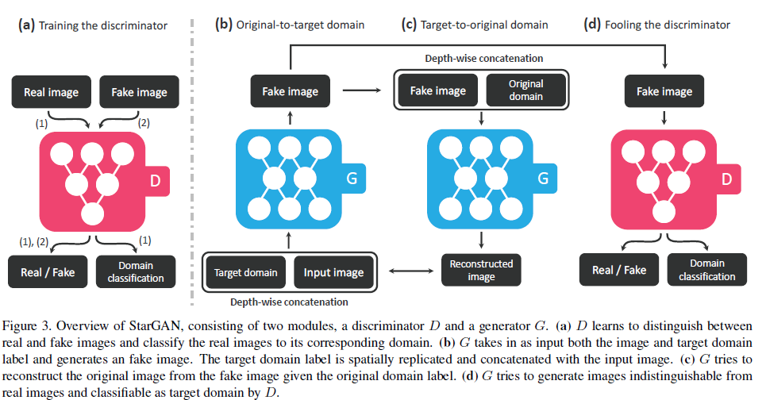
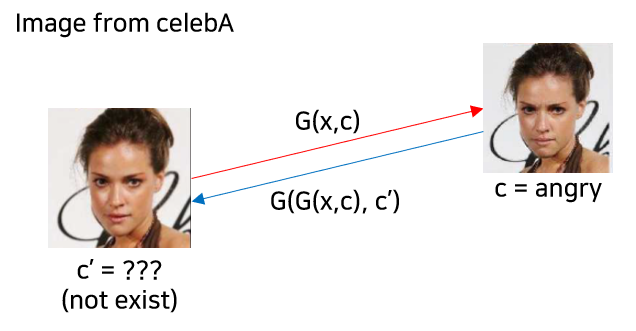
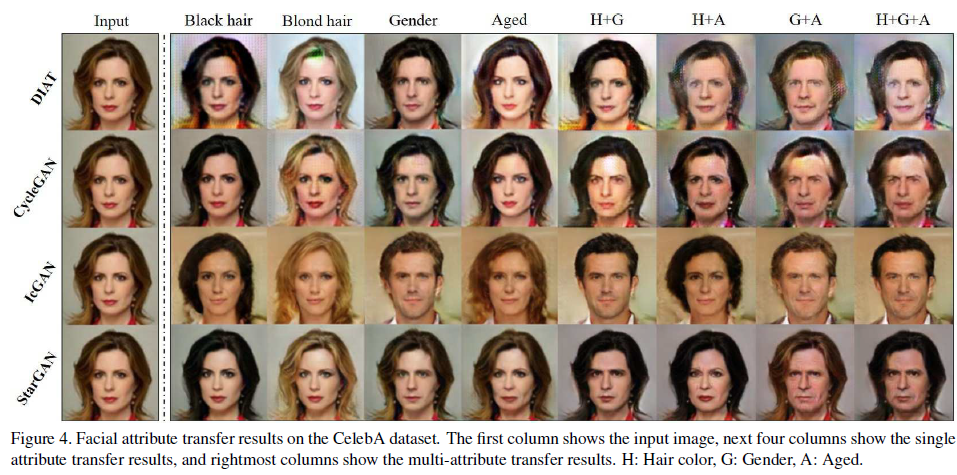
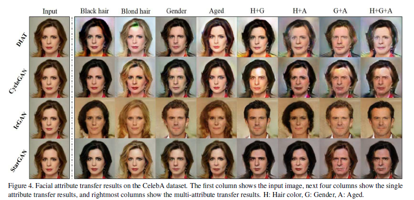
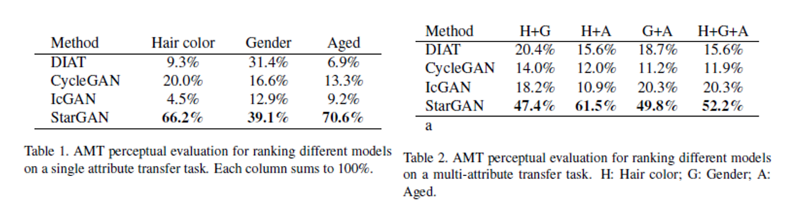
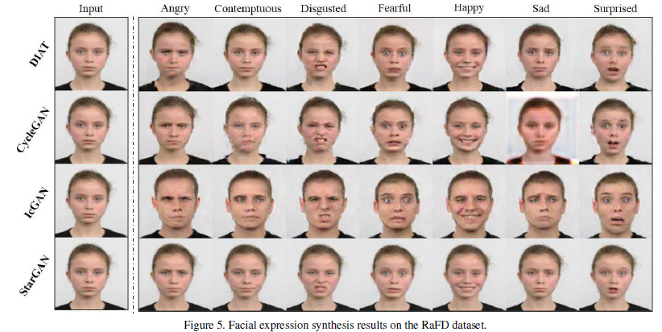
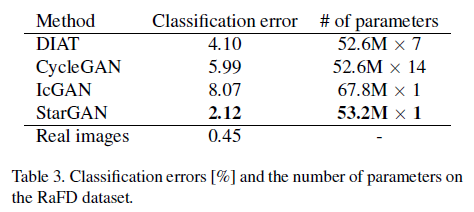
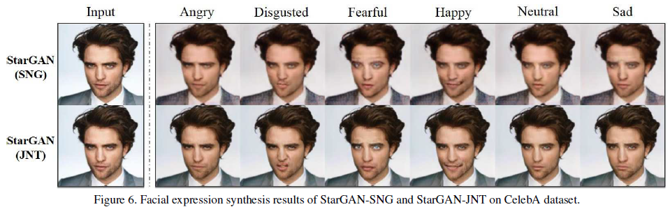
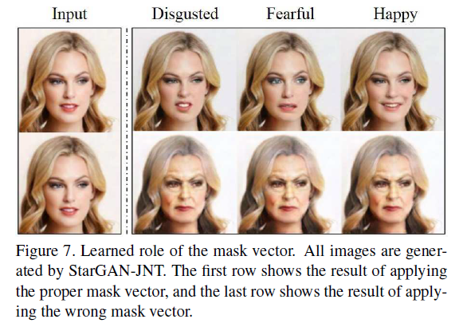

# StarGAN: Unified Generative Adversarial Networks for Multi-Domain Image-to-Image Translation
---
이전까지 unpaired image-to-image translation network인 CycleGAN 논문을 보고 구현. 해당 논문은 두 도메인 간, 비지도학습 방식으로 성공적인 translation 결과를 가져옴. 이는 추후 CyCADA 논문에서 Domain Adaptation 분야로 확장됨. 이번에 리뷰할 StarGAN 논문에서는 두 도메인 간이 아니라 여러 도메인 간의 image-to-image translation을 수행함.

## 0. Abstract
remarkabel success in image-to-image translation for **two** domains. Still, translation between more than two domains has been struggling. 
→ We propose StarGAN, a novel and scalable approach that can perform image-to-image translations for **multiple domains using only a single model.**

  

## 1. Introduction
### 용어 정리
  - **attribute**: a meaningful feature inherent in an image (hair color, gender, age)
  - **attribute value**: a particular value of an attribute (black, blond, brown for hair color or male/female for gender)
  - **domain**: a set of images sharing the same attribute value

### Multi-domain image-to-image translation?
#### 기존의 i2i translation network
- 기존의 모델은 2개의 도메인 간 translation을 수행하기 때문에, k개의 domain 간 image-to-image translation을 적용하려면 k(k-1) 개의 model을 training해야 함.
*→ ineffective and inefficient*
- 또한, 모든 domain의 training data를 활용할 수 없고 두 도메인의 training data만을 활용하기 때문에 face shape 같은 domain-agnostic한 feature를 학습하는 데에 한계가 존재한다. 이는 결국 생성 결과물 질의 저하로 이어진다.
- 다른 데이터셋 간의 joint training이 불가능함. (each datasets are bound to be partially labeled)

### StarGAN
- 하나의 G & D 쌍으로 임의 개수의 domain 간 translation이 가능함. 
→ **How?**
  - 모델의 입력으로 이미지와 도메인 정보 두 개를 넘겨주는 방식. 이후, input image를 그에 상응하는 도메인으로 translate하는 식으로 학습하게 됨.
  - 이때 domain 정보는 binary 혹은 one-hot vector의 label 형태로 주어지게 됨.
  - 학습 과정에서 target domain label을 무작위로 생성한 후 model이 input image를 해당하는 target domain으로 translate하도록 함. (이전의 translation보다 상대적으로 유연함)
    - 이렇게 함으로써 testing 단계에서 **어떤 원하는 domain에서도** 대응 가능해짐. *(기존에 학습한 것 이외에는 안되지 않나?)*
- 또한 서로 다른 데이터셋의 도메인 간의 joint training도 가능함.
  e.g.) joint training을 통해서 RaFD에서 학습한 facial expression 관련 feature들을 활용해서 CelebA images에서 facial expression을 합성할 수 있음.
→ **How?**
  - domain label에 mask vector $m$ 을 추가함 (masking하는 것보다는 concat을 통해서 추가 정보 주는 방식). → 그럼 결국에는 각 데이터셋 간에는 low level feature들만 공유하게 되고 domain specific한 feature들은 학습하지 않게 되는 건가..?
  - mask vector를 추가해줌으로써 모델이 알려지지 않은 라벨에 대해서는 무시하고, 명시적으로 주어진 라벨에 집중하도록 학습이 진행됨.

### Contribution
1. 하나의 generator와 discriminator를 통해 모든 도메인 내 이미지를 학습셋으로 활용하여 2개 이상의 도메인 간의 mapping을 학습하는 새로운 적대적 생성 신경망인 StarGAN을 제안함. (multi-domain image-to-image translation with a single adversarial pair.)
2. mask vector를 활용해서 여러 개의 데이터셋 간 multi-domain image translation을 성공적으로 학습.
3. facial attribute transfer와 facial expression synthesis 작업에서 정성적, 정량적으로 평가해보았을 때 기존 대비 좋은 성능을 보여줌.
  
  

## 2. Related Works

#### Generative Adversarial Networks
- Discriminator와 Generator 간의 적대적 학습을 통해 진짜와 구분이 어려운 가짜 이미지 생성을 가능케 함. (contributes to several tasks such as image generation, image translation, super-resolution imaging, and face image synthesis)
- **StarGAN**: leverages the adversarial loss to make the generated images as realistic as possible (adversarial loss 사용해서 realistic fake 만들겠다).

#### Conditional GANs
- Conditional GANs: GAN-based conditional image generation 
- Mirza et al.(2016), Odena et al.(2016): class information이 discriminator와 generator 모두에 input으로 주어짐으로써 output이 class 정보를 포함하는 형태로 생성.
- Reed et al. (2016), Zhang et al. (2017): Text to Image translation tasks
- 이외에 domain transfer(DiscoGAN), resolution imaging, photo editing 등 다양한 task에 활용
- **StarGAN**: domain information을 조건으로 하는 Conditional GAN 구조를 채택함으로써 다양한 target domain으로 image translation 수행 가능.

#### Image-to-Image Translation (I2I translation)
- pix2pix (paired): cGANs을 활용하여 지도학습 방식으로 i2i translation 수행. L1 Loss를 adversarial loss와 함께 활용했기 때문에 정답이 있는 형태의 지도 학습을 수행할 수 밖에 X
- Unpaired i2i translation (DiscoGAN, UNIT, CycleGAN)
  - UNIT: VAEs + CoGAN (two generators share weights to learn the joint distribution of images in cross domains)
  - CycleGAN & DiscoGAN: leveraging a Cycle Consistency Loss
→ 두 도메인 간의 translation만 가능함. 즉, multi-domain translation을 수행하기에는 그때마다 모델을 새로 학습시켜야 하기 때문에 한계가 존재함.
- **StarGAN**: 하나의 모델을 사용해서 여러 도메인 간의 translation 학습이 가능함.

  

## 3. Star Generative Adversarial Networks

### 3.1. Multi-Domain Image-to-Image Translation

- $G(x,c) → y $, with randomly generated target domain $c$ so that $G$ could learn to flexibly translate the input image
- **Auxiliary classifier $D_{cls}$** allows a single discriminator to control multiple domains.
- Thus, StarGAN discriminator produces probability distributions over both sources and domain labels, $D: x → \{D_{src}(x), D_{cls}(x)\}.$

여기서는 loss를 소개함. Generator에 관여하는 loss와 Discriminator에 관여하는 Loss를 
잘 구분할 것.
#### Adversarial Loss
  $$\min_G \max_D \mathcal{L}_{adv} = \mathbb{E}_x[logD_{src}(x)] + \mathbb{E}_{x,c}[1-logD_{src}(G(x,c))]$$
  - Generator에 input image x 이외에도 target domain label c 또한 condition으로 주어진다는 점.
#### Domain Classification Loss
- Domain Classification과 같은 경우에는 Discriminator의 가장 위쪽에 Auxiliary Classifier를 붙인 구조.
- D와 G를 학습시킬 때 모두(in both cases) domain classification loss를 부과.
- real image의 domain을 맞히고, fake image의 domain을 맞히는 구조 (probability returned)
- real의 domain을 맞히는 경우엔 D를 최적화시킬 때, fake의 domain을 맞히는 경우엔 G를 최적화시킬 때 사용.
 

- Domain classification on the **real** image (regarding **D**)
$$\mathcal{L}_{cls}^r = \mathbb{E}_{x,c'}[-log\ D_{cls}(c'|x)], where\ c': original\ domain$$
- Domain classification on the **fake** image (regarding **G**)
$$\mathcal{L}_{cls}^f = \mathbb{E}_{x,c}[-log\ D_{cls}(c|G(x,c))]$$
- 두 loss 모두 negative log likelihood 기댓값을 최소화시키는 구조.

#### Reconstruction Loss (Cycle-Consistency Loss)
$$\mathcal{L}_{rec} = \mathbb{E}_{x,c,c'}[\Vert x-G(G(x,c), c') \Vert]_1$$
  - generator output이 input의 contents를 유지하면서 필요한 부분만 translation을 수행한다는 보장이 없음. 따라서 Cycle-consistency loss를 넣어줘서 input의 contents를 유지하는 방향으로 학습.
  - Generator에 적용되며, L1 Loss의 형태를 취함.

#### Full Objective
$$\mathcal{L}_D = -\mathcal{L}_{adv} + \lambda_{cls}\ \mathcal{L}_{cls}^r \\
\mathcal{L}_G = -\mathcal{L}_{adv} + \lambda_{cls}\ \mathcal{L}_{cls}^f + \lambda_{rec}\ \mathcal{L}_{rec}$$

- $\lambda_{cls},\ \lambda_{rec}$은 하이퍼 파라미터로 각각 1과 10으로 설정

 

### 3.2. Training with Multiple Datasets
StarGAN의 경우, 동시에 다양한 label을 갖는 여러 데이터셋을 한꺼번에 학습 가능하다는 이점이 있음. 일반적으로 다양한 label을 갖는 여러 데이터셋을 동시에 학습하는 데에는 어려움이 있음. 이는 데이터셋 A, B로 구성된 데이터셋 U가 있다고 했을 때 A, B는 각각 B와 A의 label이 존재하지 않는 부분적으로 라벨링(label information is partially known to each dataset)된 데이터셋이기 때문. 

이렇게 될 경우, reconstruction 시 $c'$이 존재하지 않는 문제가 발생하게 됨. 예컨대, celebA처럼 facial attributes만 존재할 경우에는 표정과 관련된 source domain인 $c'$인 reconstruction error 계산이 안되기 때문에 facial expressions translation을 학습할 수가 없음. (아래 그림 참고)

#### Mask Vector
위의 문제를 해결하기 위해 mask vector $m$을 도입함. 위의 mask vector를 통해서 StarGAN은 데이터셋 $i$의 이미지일 경우에는 해당 데이터셋에 존재하는 라벨에만 집중하도록 함. (쉽게 말하면, celebA의 이미지 데이터셋에서는 facial attribute transfer에만 집중하고 RaFD에서는 facial expression synthesis에만 집중하는 방식. 이렇게 되어도 전체적으로 학습 이미지 개수가 증가하여 low level feature를 많이 학습하는 역할만 해주게 됨.)

mask vector $m$의 경우에는 $n$차원의 one-hot 벡터라고 함 ($n$:학습에 사용되는 데이터셋 개수).

- unified version of the label as a vector 
$$\tilde{c} = [c_1, ..., c_n, m] $$

각 label과 mask vector를 모두 concat하는 형식. $c_i$는 $i$번째 데이터셋의 라벨 벡터를 나타냄. binary attributes의 경우에는 이진 벡터로 categorical attributes의 경우에는 one-hot vector로 나타냄. 현재 데이터셋에서 갖는 라벨 이외에는 모두 0값으로 처리해버림. 각 데이터셋이 갖는 라벨 개수가 $p,q$라고 할 때 전체 라벨 벡터 길이는 $p+q+n$이 된다.

#### Training Strategy
label 차원을 제외하고 single dataset을 학습시킬 때와 동일함. $D_{cls}$의 경우에는 전체 데이터셋 내 라벨값의 분포를 추정하는 형태로 학습됨. 이 경우에는 multi-task learning setting으로 모델을 학습시키게 되는데, Discriminator가 CelebA와 RaFD를 번갈아 학습하는 형태로 multi-task learning setting이 구성된다. (하나의 모델에 CelebA 모드와 RaFD 모드가 있다고 생각하면 됨.)

  

### 4. Implementation

#### Improved GAN Training
training process를 안정화하고 보다 양질의 이미지를 생성하기 위해서 Wasserstein GAN의 목적함수에 gradient penalty를 추가한 구조로 목적함수를 설계함.

$$\mathcal{L}_{adv} = \mathbb{E}_x[D_{src}(x)] - \mathbb{E}_{x,c}[D_{src}(G(x,c))] - \lambda_{gp}\ \mathbb{E}_{\hat{x}}[(\Vert \nabla_{\hat{x}}D_{src}(\hat{x})\Vert_2 - 1)^2]$$

- $\hat{x}$ is sampled uniformly along a straight line between a pair of a real and a generated images. (이해한 바로는, real과 fake를 동일한 비율로 섞어놓고 거기서 random sampling을 한 것이 아닐까?)
- $\lambda_{gp}$ = 10으로 설정

#### Network Architecture
- Generator
  - CycleGAN의 구조를 차용
  - upsampling, downsampling의 stride = 2로 조정함.
  - 6개의 residual block을 사용함.
  - instance normalization을 활용함.

- Discriminator
  - PatchGANs 구조의 discriminator 사용
  - no normalization

  

## 5. Experiments
크게 3가지 실험을 진행.
1. StarGAN과 기존 baseline 비교
2. Classification experiments on the facial expression synthesis task.
3. joint training with multiple datasets vs single training

### 5.1. Baseline Models

#### DIAT
- cross-domain translation
- regularization to preserve identity features of the source image
  $$\Vert x-F(G(x)) \Vert_1,$$
  where $F$ is a feature extractor pretrained on a face recognition task.

#### CycleGAN
- Cycle Consistency Loss 사용
- two generators and two discriminators required for each pair of two different domains
  
#### IcGAN
- an encoder with a cGAN
- cGAN: $G: \{z,c\} → x$
- two encoders to learn the inverse mappings of cGAN, $E_z: x \rightarrow z$ & $E_c: x \rightarrow c$
- enables IcGAN to synthesis images by only changing the conditional vector and rpeserving the latent vector.

#### Comparison Table

 

### 5.2. Datasets

#### CelebA.
- crop to square of 178 and resize to 128 (original: 178X218)
- 202,599 face images with 40 binary attributes
- 2000 images for testing, remainders goes into a training set
- constructed 7 domains 
  - hair color: [black, blond, brown]
  - gender: [male, female]
  - age: [young, old]

#### RaFD
- crop to 256 and resize to 128
- 4,824 images with 8 facial expressions (with 3 different angles) → 1 attribute with 8 categories

 

### 5.3. Training
- Adam Optimizer with $\beta_1 = .5$, $\beta_2 = .999$
- horizontal flip with $ p = .5$
- 5:1 alternating training (D:G)
- CelebA: 20 epochs with learning rate = .0002(뒤의 10 epochs의 경우에는 0까지 linear learning rate decay 적용)
- RaFD: 200 epochs with learning rate = .0002 (뒤의 100 epochs의 경우에는 역시 동일한 방식으로 learning rate decay 적용)

 

### 5.4. Experimental Results on CelebA
single and multi-attribute transfer tasks에 대해서 실험을 진행

#### Qualitative evaluation

- showed a higher visual quality of results
- cross-domain의 경우에는 overfitting에 취약함. 이에 반해 StarGAN의 경우에는 보다 일반화된 성능을 보여줌.
- IcGAN과 같은 경우에는 input의 특징을 보존하는데 실패함. 그러나 starGAN과 같은 경우에는 input 특징을 잘 보존하면서도 translation을 잘 수행함. 이는 latent representation이 IcGAN에서는 저차원의 latent vector 형태로 표현되는 반면, StarGAN에서는 convolutional layer에서 추출된 activation map형태로 spatial information이 잘 보존되기 때문으로 추측.

#### Quantitative evaluation
single attribute transfer와 multiple attributes transfer 두 가지에 대해서 각각 AMT study를 진행함.
1) 사진이 진짜처럼 보이는지
2) transfer quality
3) 입력 이미지 특징의 보존

이 세가지를 기준으로 4개의 모델에 대해 best를 고르는 형태로 설문이 수행됨. 설문 결과는 아래 표와 같다. 각 영역의 의미는 해당 attribute transfer에 대해 해당 방법론이 best로 뽑힌 비율을 의미함. (column-wise sum must be 1)

single attribute transfer 중 gender의 경우에는 DIAT이 StarGAN에 견줄 만한 성과를 보였으나, mutliple transfer로 갈 경우에 StarGAN이 압도적인 결과를 보여줌.

 

### 5.5. Experimental Results on RaFD
Facial Expression Synthesis 수행. 입력은 neutral로 고정 후 나머지 7개의 domain으로 변환을 수행함.

#### Quanlitative evaluation

DIAT과 CycleGAN은 입력 특징을 잘 보존하고 있지만, blurry하거나 sharp하지 않은 이미지가 생성되었음. IcGAN과 같은 경우에는 아예 입력 특징을 보존하는 것에 실패.

StarGAN이 multi-task learning setting에서 학습이 되면서 암묵적으로 data augmentation의 효과를 얻었을 것으로 추정됨. 즉, StarGAN은 4.000장의 이미지를 모두 다 활용할 수 있어서 그러한 점에서도 output의 질을 향상시킬 수 있었을 것.

#### Quantitative evaluation
 Facial Expression Classifier(ResNet-18)를 RaFD에 대해 학습시켜 얻은 classification accuracy는 99.5% 정도로 거의 완벽함. 위의 classifier를 각 방법론의 생성 결과를 입력으로 학습시킨 후 classification error를 본다.

StarGAN이 다른 모델에 비해 낮은 error를 보여줌. 실제 이미지에 학습시킨 결과와 가장 가깝다. 또한, 파라미터 수도 나머지 모델에 비해 현저히 낮기 때문에 high scalability를 보여줌. 

 

### 5.6. Experimental Results on CelebA+RaFD
Single Datasets만을 활용하는 것과 두 데이터셋을 모두 활용해서 학습한 결과를 비교함.

#### Effects of joint training

single training의 경우에는 blurry + gray background 의 특징이 관찰됨. 그러나 joint training의 경우에는 보다 더 깔끔한 생성 결과를 보여주었음. 이는 데이터셋 개수가 늘어나면서 face keypoint detection, segmentation 등의 low-level task를 보다 잘 학습하기 때문으로 추정됨.

#### Learned role of mask vector

mask vector가 어떤 역할을 하는지 실험 수행. mask vector의 label을 일부러 반대로 뒤집어서 facial expression task를 수행했을 때 facial expression이 아니라 facial attributes이 translation된 것을 알 수 있음.

  

## 6. Conclusion
- scalable i2i translation model among multiple domains using a single pair of G and D. (high scalability)
- higher visual quality (might be due to the generalization capability behind the multi-task learning setting)
- Thanks to mask vector, training using different datasets with different domains of labels enabled.