# AN IMAGE IS WORTH 16X16 WORDS: TRANSFORMERS FOR IMAGE RECOGNITION AT SCALE
---

## 1. Introduction
- Transformer 구조의 NLP task에서의 성공
  - 높은 연산 효율성(computational efficiency)과 확장성(scalability)
  - 즉, 데이터셋과 모델 크기가 계속 커져도 모델 성능이 포화되지 않고 지속적으로 개선.
    - 지속적으로 모델을 키울 수 있다는 건 높은 연산 효율성 없이는 이루어질 수 없음.
    - 또한, 데이터셋만 추가적으로 주어지면 지속적으로 성능 향상이 이루어진다는 점에서 transformer 구조가 높은 확장성을 갖고 있음을 알 수 있음.
  - 그러나, Computer Vision Task에서는 제대로 적용이 이루어지지 않았음.

- Self-Attention을 추가한 CNN 계열 모델 구조와 아예 convolution을 attention으로 대체한 구조들이 제안됨. 그러나, 이론적으로는 효율성이 보장되었지만 실제 하드웨어 가속기와의 호환성이 떨어짐.

### Vision Transformer (ViT) 
- 이미지 자체를 **standard Transformer**에 직접적으로 넣어주는 형태로 모델 구성
- 이를 위해 이미지를 패치 단위로 쪼개 "토큰화"시켜줌.
- 패치에 linear embedding 적용 후, 시퀀스로 만들어준 형태로 Transformer 입력으로 들어가게 됨.

- 중간 사이즈의 데이터셋에 학습을 시킬 경우, 별도의 강력한 regularization 없이 기존 ResNets 대비 훌륭한 성능을 보여주지는 못함.
- 이는 Transformer 구조 자체가 CNN 구조에 비해 inductive bias가 부족하여 많은 양의 데이터 없이는 일반화가 제대로 이루어지지 않았을 것으로 추정.

- 그러나 큰 사이즈의 데이터셋(1400만 ~ 3억장)에서 학습을 시킬 경우, 위의 구조적 한계 (lack of Inductive Bias)를 극복 가능함.
- ViT는 충분한 크기의 데이터셋(ImageNet-21k or JFT-300M)에서 사전학습 후, 보다 적은 데이터셋(ImageNet, ImageNet-Real, CIFAR-100, VTAB)을 가진 task에 전이 학습을 시킬 때 좋은 성능을 보여주었음.
  - Accuracy 기준, 88.55% on ImageNet, 90.72@ on ImageNet-ReaL, 94.55% on CIFAR-100, 77.63% on the VTAB

  

## 2. Related Work
### NLP
- Vaswani et al. (2017): Transformer 구조를 기계 번역 모델로 처음 제안. 현재 많은 NLP Task에서 가장 좋은 성능을 보여주는 구조
- Devlin et al. (2019): BERT를 제안. 노이즈를 제거하는 자기지도 사전학습을 수행.
- GPT 계열 (2018, 2019, 2020): 언어 모델을 사전학습 태스크로 선정하여 수행.

 

### Computer Vision
- self-attention을 이미지에 단순 적용하는 방식은 해당 픽셀과 모든 픽셀 간의 attention weight을 구해야 하기 때문에 계산비용이 pixel 개수 n에 대하여 $O(n^2)$의 복잡도를 가짐.
- Parmar et al. (2018): local neighborhood에만 self-attention을 적용.
- Sparse Transformers (2019), Weissenborn et al. (2019): attention의 범위를 scaling하는 방식으로 self-attention을 적용하고자 함.

→ 이러한 특별한 방식의 attention의 경우에는 하드웨어 가속기에서 연산을 효율적으로 수행하기에는 다소 번거로운 작업이 포함되어 있는 경우가 다수.

- Cordonnier et al. (2020): 이미지를 2x2의 패치로 쪼갠 후, 이에 self-attention을 적용함. 위와 같은 점에서 ViT와 매우 유사하나, 이미지 패치가 매우 작으므로 저해상도 입력 이미지에만 적용이 가능하다는 단점이 있음. ViT의 경우에는 중해상도 이미지를 다룰 수 있다는 점, Vanilla Transformer 구조를 차용해 기존의 SOTA CNN보다 더 좋은 성능을 증명해냈다는 점에서 해당 연구보다 우위를 가짐.

- image GPT (Chen et al., 2020): 이미지 해상도와 color space를 줄인 후, image pixel 단위로 Transformer를 적용한 생성 모델.

 

### 기존 연구 대비 ViT의 차별점
- 표준 ImageNet 데이터셋보다 더 큰 크기의 데이터셋에서 image recognition 실험을 진행. 더 큰 크기의 데이터셋에서 학습시킴으로써 기존의 ResNets 기반 CNN보다 더 좋은 성능을 낼 수 있었음.

  

## 3. Method
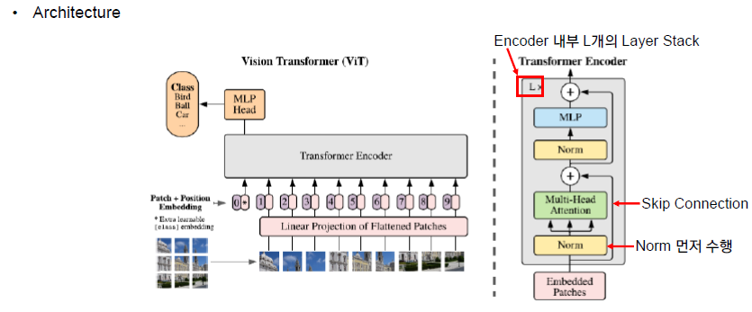

### Forward pass

#### Before Input
- $(C,H,W)$ 크기의 이미지를 크기가 $(P,P)$인 패치 N개로 자른 후, N개의 1-D 벡터 ($P^2 \cdot c$차원)로 flatten
- $N=HW/P^2$로 계산되며, $P$는 하이퍼 파라미터.
- 위의 예시는 참고용이며, 실제 실험에서는 모델 크기에 따라 $P=14, 16, 32$ 등 다양
- 이후, Linear projection을 수행하여 크기가 D인 벡터의 시퀀스로 차원 변경.
  - 이때, D는 모든 레이어 전체에 고정된 값.

#### Embedding (P=16, H=W=224, N=196, D=768)
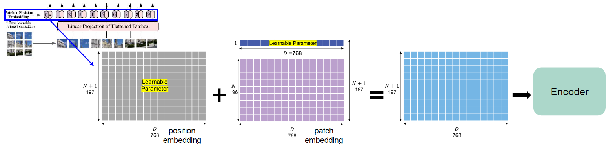
- 가장 첫번째 패치 임베딩 앞에 학습 가능한 임베딩 벡터를 붙여줌. 이는 추후 이미지 전제쳉 대한 표현을 나타내게 됨.
- N+1개의 학습 가능한 1D 포지션 임베딩 벡터 (이미지 패치의 위치를 특정하기 위함)를 만들어준 후, 이를 각 이미지 패치 벡터와 합해줌. (두 Matrix의 합)
- 만들어진 임베딩 패치를 Transformer Encoder에 입력으로 넣어줌.

#### Attention
- 개별(Single Head) Self-Attention 유닛
    1. Linear Layer (q,k,v matrix를 만들어주기 위한 차원 변경 수행)
      $$[\textbf{q},\textbf{k},\textbf{v}] = \textbf{z}\textbf{U}_{qkv}, \textbf{U}_{qkv} \in \mathbb{R}^{D \times 3D_h}$$
      $D_h$는 보통 $D/k$로 설정 ($k$는 어텐션 헤드의 개수) 하며, 이는 파라미터 개수를 head 개수에 무관하게 동일하도록 해주기 위함.

    1. q,k,v로 쪼개기
    2. Attention 가중치 A 계산
      $$ \textbf{A} = softmax(\frac{\textbf{q}\textbf{k}^T}{\sqrt{D_h}}),\ \textbf{A} \in \mathbb{R}^{N \times N} $$
    3. Attention 가중치 A로 v의 가중합 계산
      $$ SA(\bf z) = \bf Av $$

- Multi-head Self-Attention (MSA)
  위의 개별 Self-Attention 유닛을 multi-head로 확장시키기 위해서는 차원 변경을 해줄 때에 head dimension을 반영해주면 된다. (SA 유닛을 k개 concat한 형태)

  처음의 ${\bf U}_{qkv} $의 차원을 $D \times 3D_h$가 아닌 head 개수를 곱해준 $D \times 3kD_h$ 로 변경해주면 됨. 이때 $D_h = D/k$이므로, 결국에는 ${\bf U}_{qkv} $의 차원은 $D \times 3D$로 정해지게 된다. 

  $$ MSA({\bf z}) = [SA_1({\bf z});SA_1({\bf z});...;SA_k({\bf z})]{\bf U}_{msa}, \ \ {\bf U}_{msa} \in \mathbb{R}^{k\cdot D_h \times D} $$

  이때 $D_h = D/k$이므로, 위의 식은 다음과 같이 쓸 수 있다.

  $$ MSA({\bf z}) = [SA_1({\bf z});SA_1({\bf z});...;SA_k({\bf z})]{\bf U}_{msa}, \ \ {\bf U}_{msa} \in \mathbb{R}^{D \times D} $$

#### MLP (FFN)
MLP의 경우, 2개의 hidden layer와 GELU (Gaussian Error Linear Unit) 활성화 함수로 구성되어 있음. Hodden layer의 차원의 경우에는 하이퍼 파라미터로 3072, 4096, 5120의 옵션이 존재함.

#### Classification Head
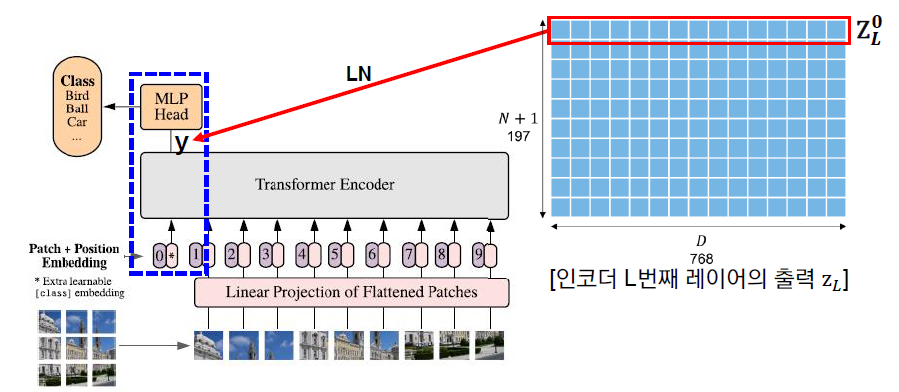

앞의 과정을 L번 반복함.
마지막으로 classification을 수행하기 위해 encoder 최종 아웃풋의 가장 첫번째 벡터인 y를 하나의 hidden layer ($D \times C$)로 구성된 MLP Head에 통과
사전학습 완료 후 Fine-tuning 시에는 위의 MLP Head가 아닌, single linear layer를 통과함.

### Inductive Bias
CNN의 경우에는 다음과 같은 image-specific한 Inductive Bias가 존재함.
- Locality
- Two-Dimensional neighborhood structure (2차원적으로 이웃하는 구조)
- Translation equivariance

위의 가정이 ViT에서는 훨씬 약하게 작용함. (이러한 부분을 ViT에서는 data-driven training으로 해결 & 오히려 inductive bias가 없는 부분을 ViT에서는 보다 task-agnostic unified structure로 보는 관점을 갖고 있는 듯함)

#### How Inductive Bias operates on ViT
- MLP layers: Locality and translation equivariance
- 2D neighborhood structure: 입력 패치로 자르는 과정 (학습), position embedding 조정 (fine-tuning)

#### Locality (=Locality of Pixel Dependencies)
이미지를 구성하는 특징들은 이미지 전체가 아닌 일부 지역들에 근접한 픽셀들로만 구성되고 근접한 픽셀들끼리만 종속성을 갖는다는 가정.

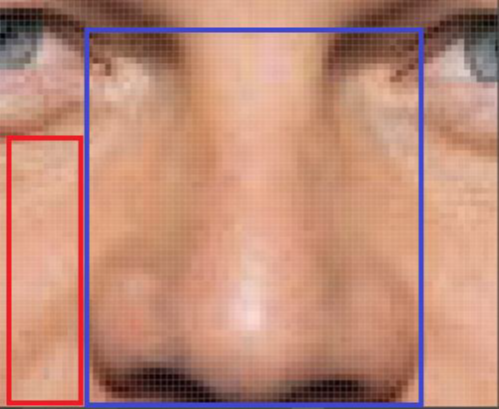

위의 사진을 보았을 때, 코라는 특징은 파란색 사각형 안에 있는 픽셀값에서만 표현되고, 해당 픽셀들끼리만 관계를 가짐. 빨간색 사각형 안의 픽셀들은 파란색 사각형 안의 픽셀과는 종속성이 없음. 즉, 종속성을 갖는 픽셀들은 local하게 존재하지, 전역적으로 종속성이 있다고 보기는 어려움. Convolution 연산은 이러한 이미지의 locality 특징에 잘 부합하는 방식으로 동작.

#### Translation Equivariance
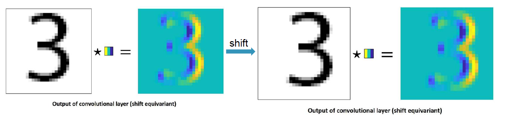

입력의 위치 변화에 따라 출력 또한 입력과 동일하게 변화하는 것. Convolution 연산은 Translation equivariant하다는 특성을 갖는다. (↔ Translation Invariance)

### Hybrid Architecture
Raw Image patches가 아닌, CNN을 통과한 feature map을 input sequence로 넣어줌. 이 경우에는 patch의 크기 P를 1로 설정하여, patch 단위로 crop할 필요 없이 바로 flatten해서 Transformer의 차원(D)으로 projection.

### Fine-tuning and higher-resolution
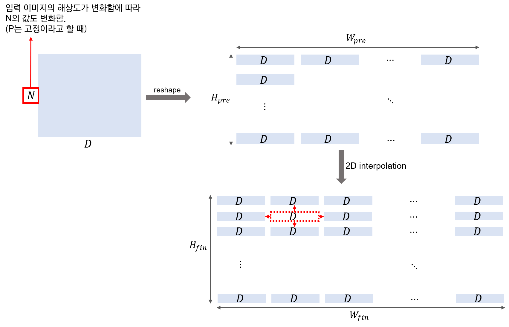

사전학습된 prediction head를 제거하고 0으로 초기화된 $D \times K $ feed-forward layer를 붙여줌. 이때, K는 downstream class의 개수.
사전학습 시보다 더 높은 해상도의 이미지로 fine-tuning하는 것이 더 좋은 결과를 가져옴. 하지만 이 경우에는 기존의 positional embedding이 더 이상 의미가 없어지게 됨.

이때, 입력 이미지 크기 내 패치 위치에 맞게 positional embedding도 2차원 보간을 적용하여 값을 채워줌. 이러한 해상도 조정과 패치 추출이 ViT 내에서 수동적으로 image-specific inductive bias를 추가해주는 부분.

## 4. Experiments
### Datasets
- ILSVRC-2012 ImageNet Dataset with 1k classes and 1.3M images
- superset ImageNet-21k with 21k classes and 14M images
- JFT with 18k classes and 303M high-resolution images

- downtream tasks
  - ImageNet (validation sets)
  - ImageNet with cleaned-up ReaL Labels
  - CIFAR-10/100
  - Oxford-IIIT Pets
  - Oxford Flowers-102

- VTAB Datasts for 19 tasks
  - 19개의 downstream tasks
  - Natural, Specialized (의료, 위성 사진 등), Structured (localization 같은 이미지 내 기하에 대한 이해 바탕의 task로 구성)의 3개 그룹으로 분류

### Model Variants
- ViT
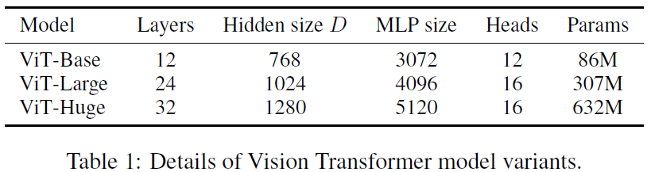
- baseline
  ResNet with Group Normalization & Standardized Convolutions (BiT)
- Hybrids
  ViT에 ResNet의 stage 4 feature map을 입력으로 넣어주고 patch size = 1로 설정

### Training Details
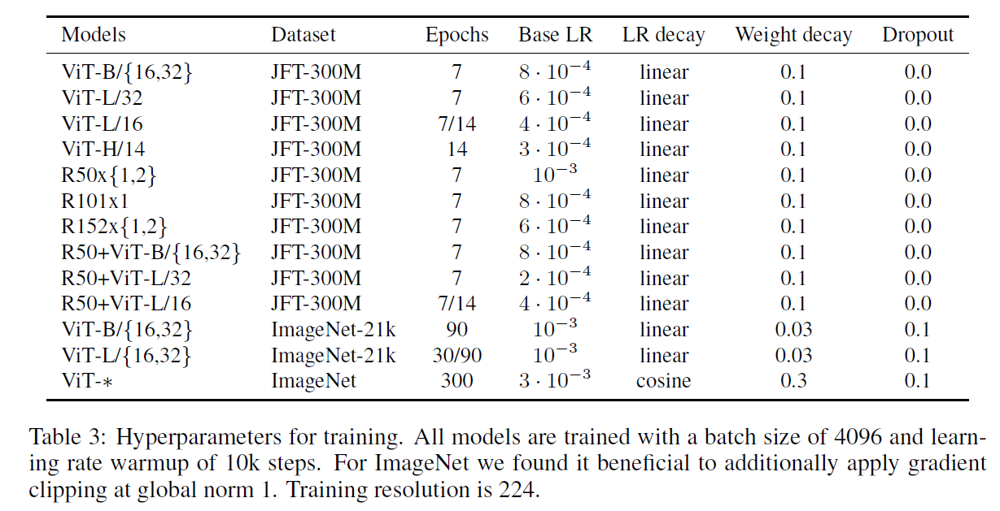
- optimizer: Adam for Pre-training and SGD for fine-tuning
- batch size: 4096
- linear warmups + Learning Rate Decay (Cosine or Linear)

### SOTA와의 성능 비교
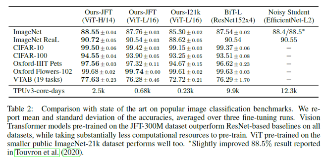
- 전이학습 평가를 위한 각 데이터셋 별 ViT 모델과 기존 전이학습 SOTA CNN 모델과의 (BiT-L / NoisyStudent) 성능 비교
- fine-tuning을 각각 3번 진행하고 **정확도**의 평균과 표준편차를 계산하여 정확성을 평가
- **TPUv3-core-days** = 사전학습 시 사용된 코어 수 X 소요 일수 (효율성을 평가하는 지표)
- 중간 사이즈의 데이터셋: Baseline > ViT ; 큰 사이즈의 데이터셋: ViT > Baseline
- ViT의 경우 모델 파라미터(모델 규모)가 증가하고, 데이터셋의 크기가 증가할 수록 지속적으로 성능이 증가. (no saturation)

### Pre-training Data Requirements
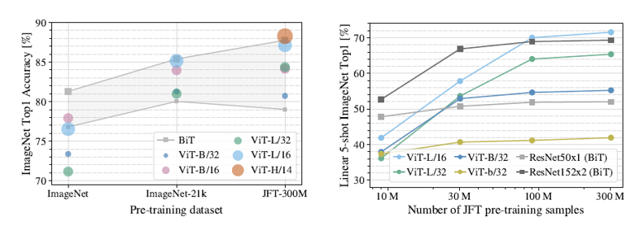
- ViT는 Inductive Bias가 기존 CNN 계열보다 부족하기 때문에 사전학습 데이터셋 크기가 클 때 좋은 성능을 보여줌. 이때 사전학습 시 사용되는 데이터셋 크기가 ViT에 어떤 영향을 미치는지에 대한 실험을 진행.
- ImageNet (1.3M), ImageNet21K (14M), JFT (300M)에 사전학습하고 ImageNet 데이터셋에 대해 분류 성능 평가를 진행. 
  - 이때 가장 작은 데이터셋에서 사전 학습 수행 시, weight decay, dropout, label smoothing과 같은 regularization을 적용함.

### Scaling Study
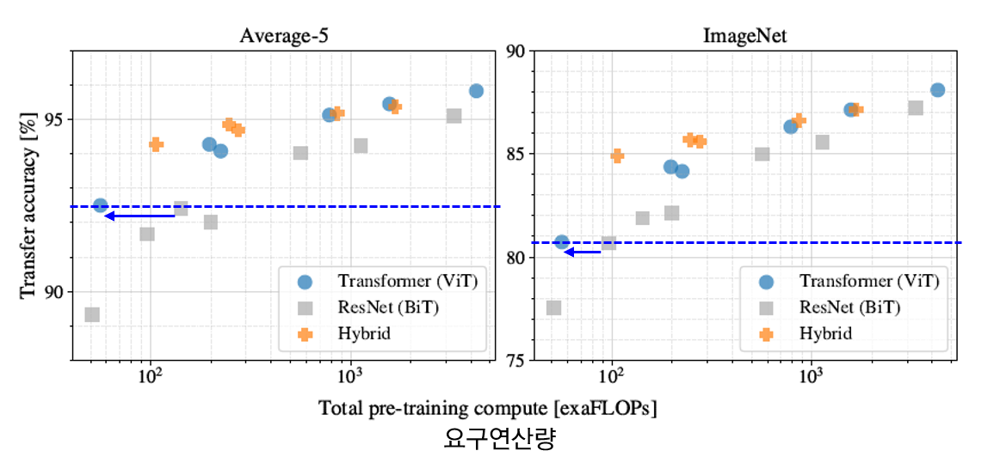
- JFT 300M 데이터셋에서 모델 별로 계산량/성능을 비교하는 실험 진행. (하이퍼 파라미터 고정)
- ViT 계열은 ResNet 계열에 비해 동일 성능을 얻기 위한 연산량이 더 적음.
- hybrid의 경우, 연산량이 증가하긴 했으나 ViT보다 더 좋은 성능을 보여줌.
- ViT 계열은 ResNets 계열과 달리 모델이 커짐에도 불구하고 성능 포화 없이 지속적으로 성능이 증가함을 보여줌.

### Inspecting Vision Transformer
ViT의 내부를 분석하기 위해 3가지 실험을 진행함.

#### 1) 필터 시각화
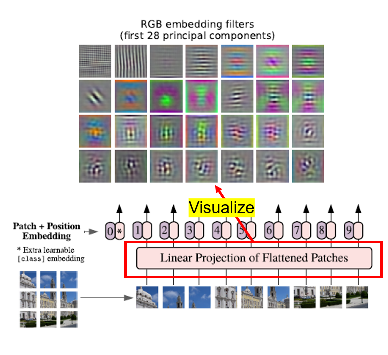

첫번째 linear projection 부분에서 주요 요소를 28개 선정하여 시각화함 (PCA를 통해서 D개의 필터 중 28개를 선정한 것으로 추정). 이 경우에 잘 학습된 CNN의 앞쪽 레이어를 시각화했을 때와 유사한 결과가 나타남.즉, 잘 학습된 CNN과 같이 이미지 인식에 필요한 edge, color 등의 low-level 특징들을 잘 포착하고 있음을 파악할 수 있음.
기존의 $c \cdot p^2 \times D $ 크기의 가중치 행렬을 $ D \times c \times p \times p$ 로 변환 후 시각화 했을 것으로 추정.

#### 2) 위치 임베딩 유사도 분석
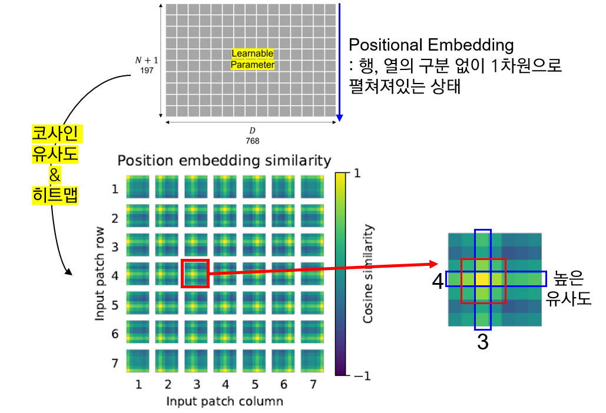
행렬의 각 요소는 i번째 패치 행, j번째 패치 열에 대한 코사인 유사도 값의 히트맵으로 구성되어 있음.

위치 임베딩의 i번째 열, j번째 행 값이 이웃한 열, 행의 임베딩 값과 높은 유사도를 보임을 알 수 있음. 즉, 가까운 패치일 수록 높은 유사도를 보여줌. 또한, 상대적으로 같은 열 & 같은 행의 위치 임베딩 값과 높은 유사도. 

이는 ViT에서 1차원 임베딩을 사용했음에도 불구하고, 내부적으로 2차원의 이미지 위상을 잘 파악하고 있음을 알 수 있다. 즉, 1차원 위치 임베딩만으로도 2차원 이미지를 표현하기에 충분함을 시사함.

#### 3) Attention Distance
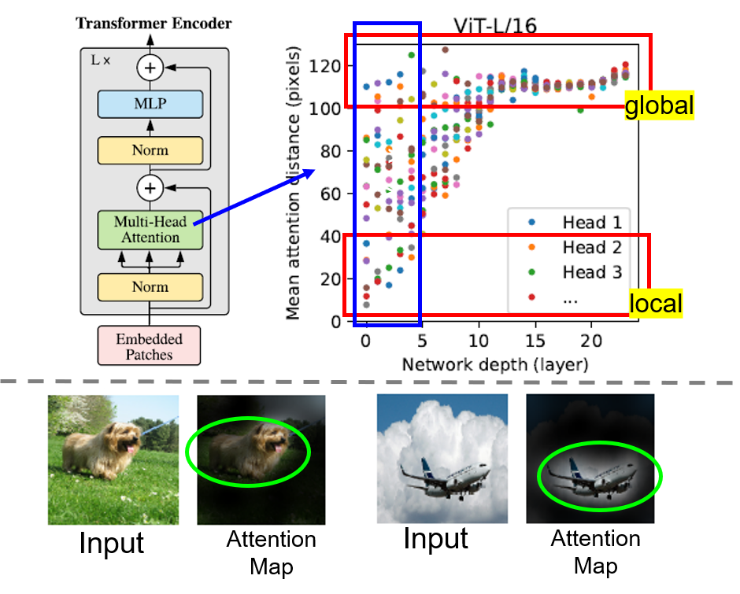

Attention Distance는 CNNs의 Receptive Field와 유사한 개념으로 볼 수 있음을 알고 넘어가자.

Self-Attention은 네트워크가 가장 첫번째 레이어에서도 이미지 전체적인(global) 특성을 파악할 수 있도록 함.
이를 확인하기 위해 Attention weights를 바탕으로 Mean Attention Distance를 계산하여 한 픽셀에서 어느 정도 떨어져있는 픽셀까지 주목(attend)하는지 실험을 통해 보여줌.

위의 그림에서 알 수 있다시피 이미 첫번째 레이어에서부터 전역적 특성을 잡아내는 것이 가능함. 물론 지역석 특성 또한 잘 잡아내며, layer가 깊어질 수록 ViT 내부의 모든 헤드에서 대부분 전역적 특성을 잘 잡아냄을 알 수 있음. 최종적으로는 아래 그림과 같이 분류작업과 관련 있는 부분을 attend하는 경향이 존재함.

### Self-Supervision

기존의 NLP 태스크에서의 Transformer는 BERT 등과 같이 Self-supervision pretext task와 같이 엮어서 많이 사용되고, 좋은 성능을 보여주고 있음.
 
이러한 맥락을 그대로 반영하여, ViT의 경우에도 사전 학습 시 패치를 마스킹하고 이를 예측하는 방식의 self-supervised task를 적용하여 학습 (BERT의 태스크를 모방). JFT-300M 데이터셋에서 배치 사이즈를 4096으로 설정해 100만 스텝(14 에폭 정도) 동안 학습을 수행함. 

Masked patch prediction (마스킹 비율: 50%)을 사전학습 시 수행하고 ImageNet에 fine-tuning시킨 결과, ViT-B/16 모델로 ImageNet에서 79.9%의 정확도를 보여주었음.
 
이는 처음부터 학습시킨 결과보다 2% 높은 결과이지만, 지도학습으로 사전학습 후 fine-tuning한 결과보다는 4% 정도 낮은 정확도임.

## 5. Conclusion
### Contribution
- image recognition 분야에 Transformer를 직접적으로 적용한 첫 사례
- 간단하면서 높은 확장성을 가진 Transformer 구조를 성공적으로 Image Recognition에 적용
- 이미지에 특정된 inductive bias를 아키텍처에 주입하지 않음 (이미지 패치 추출 부분 제외)
  - 모델 학습 과정 전체적으로 이미지를 NLP에서 사용되던 것처럼 패치 시퀀스로 다룸
  - inductive bias가 약하기 때문에 보다 general-purpose의 architecture라고 할 수 있음. (one-for-all)
- 큰 사이즈의 데이터셋에서 사전 학습한 후에 기존의 CNN 기반 baseline보다 더 좋은 성능. 추가적으로, 사전학습이 그리 어렵지 않다는 점.

### Challenges
- 본 연구에서는 classification task에만 적용하였기에 segmentation, detection 등의 다른 computer vision task에도 적용이 성공적으로 되는지는 아직 정확히 알 수 없음.
- 사전학습 시, self-supervised learning 방법론을 성공적으로 적용시킬 방안을 탐색해야 함.
- self-supervised learning 방식으로 사전학습을 해서 나쁘지 않은 결과를 얻었지만 large-scale supervised pre-training과는 큰 차이가 있었음.
- 모델 구조 개선을 통한 모델 성능 향상의 여지가 존재함.

